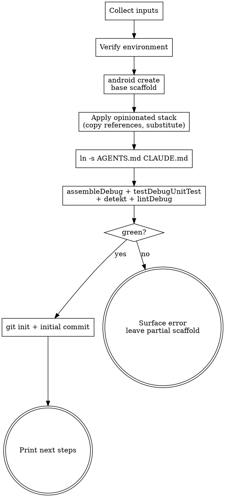

# Create a new Android app

Scaffolds a single-module Android app with a locked-in stack, then verifies it builds, tests, and lints cleanly. The end state is an empty scaffold (no demo screens) ready for the user to write their first Circuit feature.

## What this skill produces

- Single-module app at `<output>/<appNameSnake>/`
- Compose-only, Circuit-native nav, blank start screen
- Metro DI graph, Material You theme, edge-to-edge, Core SplashScreen, predictive back
- Coil 3 `ImageLoader` provided through Metro, kermit logger, Ktor client
- Crashlytics pre-wired, gated on `app/google-services.json` presence
- `runDebug` / `runRelease` / `runDebugAll` / `runReleaseAll` Gradle tasks
- `AGENTS.md` (real file) + `CLAUDE.md` (symlink)
- `.github/workflows/ci.yml`, detekt + ktlint, Roborazzi screenshot tests
- Commit `Initial scaffold via new-android-app skill`

## Workflow



### Step 1 — Collect inputs

Ask the user, one prompt at a time:

1. **App display name** (e.g. `Halogen`).
2. **Package name** (e.g. `me.mmckenna.halogen`). Validate against `^[a-z][a-z0-9_]*(\.[a-z][a-z0-9_]*)+$`. Reject and re-prompt on failure.
3. **Output directory** (default: current working directory).
4. **Min SDK** (default: 26).
5. **Initialize git?** (default: yes).

Derive:
- `appNameSnake` = display name lowercased, non-alphanumerics → `_`.
- `packagePath` = package name with `.` → `/`.
- `targetSdk` = highest installed platform from `android sdk list --installed`.

### Step 2 — Verify environment

Run, in this order, and stop on the first failure with a user-facing message:

```bash
which android         # android CLI present?
java -version         # JDK 21+?
android sdk list --installed    # at least one platform + build-tools?
```

If `android` is missing, point the user at the `android-cli` skill's setup notes. If JDK is missing or older, suggest `sdkman install java 21-tem` or equivalent.

### Step 3 — Scaffold base via `android create`

Pick the simplest Compose-capable template. Run `android create --list` if unsure. Default template: **`empty-activity`**.

```bash
android create empty-activity --name="<App Display Name>" --output=<output> --minSdk=<minSdk>
```

This produces a buildable starting point. The next step heavily overwrites it.

### Step 4 — Apply the opinionated stack

For each entry below, copy the file from `references/` to its target path, substituting `{{packageName}}`, `{{packagePath}}`, `{{appName}}`, `{{appNameSnake}}`, `{{minSdk}}`, `{{targetSdk}}`. Files marked `verbatim` copy without substitution.

**Build & tooling:**

| Reference | Target |
|---|---|
| `settings.gradle.kts.tmpl` | `settings.gradle.kts` |
| `root.build.gradle.kts` (verbatim) | `build.gradle.kts` |
| `libs.versions.toml` (verbatim) | `gradle/libs.versions.toml` |
| `app.build.gradle.kts.tmpl` | `app/build.gradle.kts` |
| `run-tasks.gradle.kts` (verbatim) | `gradle/run-tasks.gradle.kts` |
| `build-logic/` (whole tree, with placeholder substitution in `convention/build.gradle.kts`) | `build-logic/` |
| `gitignore` (verbatim) | `.gitignore` |
| `editorconfig` (verbatim) | `.editorconfig` |
| `detekt.yml` (verbatim) | `config/detekt/detekt.yml` |
| `ci.yml` (verbatim) | `.github/workflows/ci.yml` |
| `google-services.json.example` (verbatim) | `app/google-services.json.example` |

**App source (under `app/src/main/kotlin/{{packagePath}}/`):**

| Reference | Target |
|---|---|
| `App.kt.tmpl` | `App.kt` |
| `MainActivity.kt.tmpl` | `MainActivity.kt` |
| `AppGraph.kt.tmpl` | `di/AppGraph.kt` |
| `CircuitConfig.kt.tmpl` | `circuit/CircuitConfig.kt` |
| `RootScreen.kt.tmpl` | `nav/RootScreen.kt` |
| `Color.kt.tmpl` | `ui/theme/Color.kt` |
| `Type.kt.tmpl` | `ui/theme/Type.kt` |
| `Theme.kt.tmpl` | `ui/theme/Theme.kt` |
| `AndroidManifest.xml.tmpl` | `app/src/main/AndroidManifest.xml` |

**Tests (under `app/src/test/kotlin/{{packagePath}}/`):**

| Reference | Target |
|---|---|
| `ExampleTest.kt.tmpl` | `ExampleTest.kt` |
| `RootPresenterTest.kt.tmpl` | `nav/RootPresenterTest.kt` |
| `ThemeScreenshotTest.kt.tmpl` | `ui/theme/ThemeScreenshotTest.kt` |

**Agent guidance:**

| Reference | Target |
|---|---|
| `AGENTS.md.tmpl` | `AGENTS.md` |

**Splash theme**: the manifest references `@style/Theme.{{appName}}.Splash`. Append the following style to `app/src/main/res/values/themes.xml` (the `android create` template generates a base `themes.xml`):

```xml
<style name="Theme.{{appName}}.Splash" parent="android:Theme.Material.Light.NoActionBar" />
```

After all files are written, delete every leftover source the `android create` template generated. The defaults conflict with the new structure (e.g. `com.example.<app>.MainScreenViewModelTest` referencing classes that no longer exist). Run:

```bash
# Drop default sources outside our package. Use `find` with `! -path` so the new files we just wrote are kept.
find "$APP_DIR/app/src/main/java"   -mindepth 1 -delete 2>/dev/null || true
find "$APP_DIR/app/src/main/kotlin" -mindepth 1 ! -path "$APP_DIR/app/src/main/kotlin/$PKG_PATH*" -delete 2>/dev/null || true
find "$APP_DIR/app/src/test/java"   -mindepth 1 -delete 2>/dev/null || true
find "$APP_DIR/app/src/test/kotlin" -mindepth 1 ! -path "$APP_DIR/app/src/test/kotlin/$PKG_PATH*" -delete 2>/dev/null || true
find "$APP_DIR/app/src/androidTest/java"   -mindepth 1 -delete 2>/dev/null || true
find "$APP_DIR/app/src/androidTest/kotlin" -mindepth 1 ! -path "$APP_DIR/app/src/androidTest/kotlin/$PKG_PATH*" -delete 2>/dev/null || true
```

### Step 5 — Create the CLAUDE.md symlink

```bash
cd <output>/<appNameSnake>
ln -s AGENTS.md CLAUDE.md
```

Verify with `ls -la CLAUDE.md` showing `CLAUDE.md -> AGENTS.md`.

### Step 6 — Sanity build

Run, in order, with `-q --console=plain`:

```bash
./gradlew -q --console=plain :app:assembleDebug
./gradlew -q --console=plain :app:testDebugUnitTest
./gradlew -q --console=plain :app:detekt :app:lintDebug
```

If any step fails:
1. Print the failing task and the last ~50 lines of output.
2. Stop without committing.
3. Tell the user the partial scaffold is at `<output>/<appNameSnake>` for inspection.

### Step 7 — Initialize git (if requested)

```bash
cd <output>/<appNameSnake>
git init
git add .
git commit -m "Initial scaffold via new-android-app skill"
```

If `git init` fails, warn but do not roll back the scaffold.

### Step 8 — Report next steps

Print to the user:

> Scaffold complete at `<output>/<appNameSnake>`.
>
> Next steps:
>
> 1. **Add Crashlytics:** Create a Firebase project, download `google-services.json`, and drop it in `app/`. See `AGENTS.md` for details.
> 2. **Run on a device:** `./gradlew runDebug` (single device) or `./gradlew runDebugAll` (all connected).
> 3. **Add your first feature:** Follow the "Adding a feature" recipe in `AGENTS.md`. Use `circuit-test` for the presenter.
> 4. **Use the `android-cli` skill** for SDK / device / docs operations.
> 5. **Use the upstream `edge-to-edge` skill from the `android` CLI** if you hit inset or system-bar issues when adding real screens.

## Composes with

- **`android-cli`** — used in steps 2 and 3, surfaced in step 8's next steps.
- **`edge-to-edge` (from the upstream `android` CLI)** — referenced in `AGENTS.md` and step 8 as the canonical guide for inset issues.
- **`superpowers:test-driven-development`** — recommended for adding new features (TDD-first via `circuit-test`).
- **`superpowers:verification-before-completion`** — step 6 is the verification gate.

## Failure modes

- **`android create` fails:** surface stderr, suggest `android sdk list --installed` / `android init`, stop.
- **Gradle smoke build fails:** print failing task + last 50 lines, stop without committing. Leave the partial scaffold for inspection.
- **`git init` fails:** scaffold is complete; warn and continue.
- **Package name regex fails:** prompt again rather than generating a half-broken project.
- **`ln -s` fails (Windows or restricted FS):** create `CLAUDE.md` as a regular copy of `AGENTS.md` instead. Document in the user's report that they should re-create the symlink (or maintain copies) on platforms that don't allow user symlinks.
