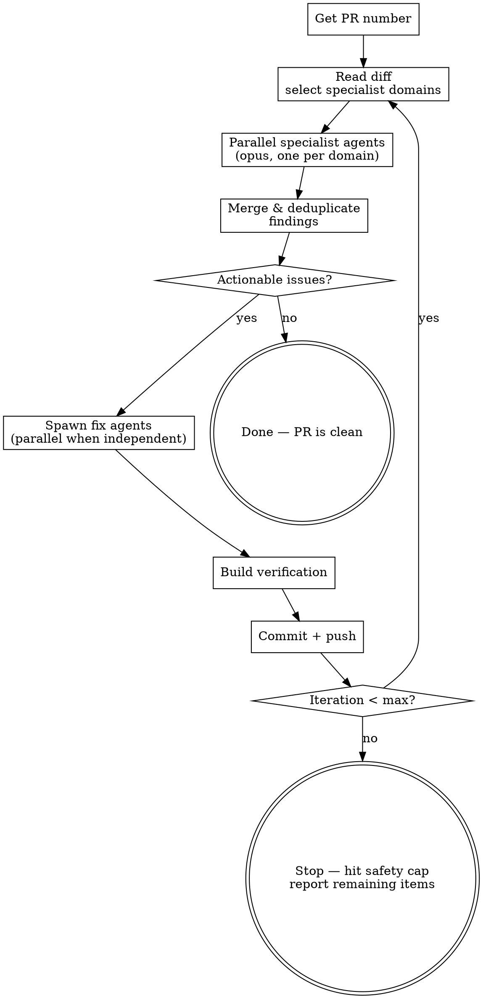

# Review-Cycle Specialist Agent Team — Implementation Plan

> **For agentic workers:** REQUIRED SUB-SKILL: Use superpowers:subagent-driven-development (recommended) or superpowers:executing-plans to implement this plan task-by-task. Steps use checkbox (`- [ ]`) syntax for tracking.

**Goal:** Replace the review-cycle skill's single review agent with a dynamically composed team of parallel specialist review agents.

**Architecture:** The calling LLM reads the PR diff, decides which specialist domains need review, spawns parallel opus agents (one per domain), then merges and deduplicates their findings before triaging and fixing. Each loop iteration re-analyzes the full diff holistically and re-selects specialists.

**Tech Stack:** Markdown skill file (no application code — this is a skill definition)

**Spec:** `docs/superpowers/specs/2026-04-15-review-cycle-specialist-agents-design.md`

---

### Task 1: Update intro text and workflow diagram

**Files:**
- Modify: `skills/review-cycle/SKILL.md:1-33`

- [ ] **Step 1: Update the intro paragraph**

Replace the intro paragraph (line 6) with:

```markdown
Automated review-fix-push loop for pull requests. Reads the PR diff, spawns a team of specialist review agents in parallel (security, performance, validation, etc. — chosen dynamically based on the diff), merges their findings, fixes what's actionable, pushes, and repeats until the reviews come back clean — or hits the safety cap.
```

- [ ] **Step 2: Replace the workflow diagram**

Replace the entire `dot` diagram (lines 10-32) with:



- [ ] **Step 3: Commit**

```bash
git add skills/review-cycle/SKILL.md
git commit -m "chore(review-cycle): update intro and workflow diagram for specialist agents"
```

---

### Task 2: Replace step 2 with diff analysis & agent selection

**Files:**
- Modify: `skills/review-cycle/SKILL.md:45-58`

- [ ] **Step 1: Replace step 2 content**

Replace the entire "### 2. Review (Fresh Agent)" section (lines 45-58) with:

```markdown
### 2. Diff Analysis & Agent Selection

Read the PR metadata and diff:

\`\`\`bash
gh pr view <number>
gh pr diff <number>
\`\`\`

Analyze what's changing — which files, what domains are touched (API routes, database queries, UI components, auth logic, config changes, etc.) — and decide which specialist agents to spawn.

**Selecting specialist domains:**
- Pick domains where deep focused attention adds value for this specific diff (e.g., "security", "performance", "input validation", "error handling", "accessibility", "correctness", "data integrity")
- Each specialist should cover something the others won't — avoid overlapping mandates
- Scale the number of agents to the PR's complexity — a one-file typo fix needs fewer specialists than a PR touching auth middleware across 20 files
- There is no fixed menu — use your judgment based on what the diff actually contains

**Write a focused prompt for each specialist** that includes:
- The specific domain/lens to review through
- Concrete examples of what to look for in that domain
- The PR number so the agent can fetch the diff itself
- Instructions to categorize findings as "actionable" (fix before merge) vs "informational" (awareness only)
- For round 2+, a summary of what was fixed in prior rounds so the agent doesn't re-flag resolved items
```

- [ ] **Step 2: Commit**

```bash
git add skills/review-cycle/SKILL.md
git commit -m "chore(review-cycle): replace single review agent with diff analysis & agent selection step"
```

---

### Task 3: Add new step 3 — parallel specialist reviews

**Files:**
- Modify: `skills/review-cycle/SKILL.md` (insert after the new step 2, before the old step 3)

- [ ] **Step 1: Insert step 3 after the new step 2**

Add this new section immediately after step 2:

```markdown
### 3. Parallel Specialist Reviews

Spawn all specialist agents in parallel. Each agent is an **opus** agent that:

1. Fetches the PR diff via `gh pr diff <number>`
2. Reviews the entire diff exclusively through its assigned lens
3. Returns findings in this format:

\`\`\`
## [Domain] Review

### Actionable
- **[file:line]** — Description of the issue and why it matters

### Informational
- **[file:line]** — Observation (no fix needed)
\`\`\`

**Specialist constraints:**
- Stay in your lane — a security agent should not flag naming conventions, a performance agent should not suggest style changes
- Be specific — cite file paths, line numbers, and what's wrong
- Actionable means "fix before merge"; informational means "be aware"
- Don't suggest refactors or style changes unless genuinely in-domain (e.g., a performance agent flagging an O(n²) loop is in-domain; suggesting a variable rename is not)
```

- [ ] **Step 2: Commit**

```bash
git add skills/review-cycle/SKILL.md
git commit -m "chore(review-cycle): add parallel specialist reviews step"
```

---

### Task 4: Replace triage step with merge, deduplicate & triage

**Files:**
- Modify: `skills/review-cycle/SKILL.md` (the old step 3 "Triage Review Results")

- [ ] **Step 1: Replace the triage section**

Replace the old "### 3. Triage Review Results" section with:

```markdown
### 4. Merge, Deduplicate & Triage

After all specialist agents return:

1. **Merge** all findings into a single list
2. **Deduplicate** — if two agents flag the same location for related reasons (e.g., security agent flags unsanitized input, validation agent flags missing input check on the same line), combine into one finding with the stronger rationale
3. **Triage** the merged list:

- **Fix** — genuine issues worth addressing
- **Skip** — style preferences, informational notes, or things that aren't worth the churn

If nothing is actionable, **stop**. The PR is clean.
```

- [ ] **Step 2: Commit**

```bash
git add skills/review-cycle/SKILL.md
git commit -m "chore(review-cycle): replace triage with merge, deduplicate & triage step"
```

---

### Task 5: Renumber remaining steps and update loop description

**Files:**
- Modify: `skills/review-cycle/SKILL.md` (steps 4-7 become steps 5-8)

- [ ] **Step 1: Renumber step headers**

Update the step headers for the remaining unchanged sections:
- `### 4. Implement Fixes` → `### 5. Implement Fixes`
- `### 5. Build Verification` → `### 6. Build Verification`
- `### 6. Commit and Push` → `### 7. Commit and Push`
- `### 7. Loop or Stop` → `### 8. Loop or Stop`

- [ ] **Step 2: Update the loop description**

Replace the content of the "Loop or Stop" section with:

```markdown
- If iteration count < **5** (safety cap), go back to step 2. Re-read the full PR diff holistically (including all changes from prior rounds), re-analyze which specialist domains are relevant, and spawn fresh specialist agents. The diff and the domains may change between rounds — a fix in one area can introduce issues in another.
- If at the cap, stop and report any remaining items to the user.

The loop should converge quickly — most PRs are clean after 2-3 rounds.
```

- [ ] **Step 3: Update the cross-reference in step 5 (Implement Fixes)**

In the Implement Fixes section, update the parenthetical reference from `(see step 5 for detection)` to `(see step 6 for detection)`.

- [ ] **Step 4: Commit**

```bash
git add skills/review-cycle/SKILL.md
git commit -m "chore(review-cycle): renumber steps 5-8 and update loop description"
```

---

### Task 6: Update design decisions and common mistakes tables

**Files:**
- Modify: `skills/review-cycle/SKILL.md` (Key Design Decisions and Common Mistakes sections)

- [ ] **Step 1: Replace the Key Design Decisions table**

Replace the entire Key Design Decisions table with:

```markdown
| Decision | Rationale |
|----------|-----------|
| Dynamic specialist selection | No fixed menu — the LLM picks review domains based on what the diff actually contains. A config PR gets different specialists than an auth middleware PR. |
| Opus for specialist agents | Reviews require judgment about what matters — Opus catches subtler issues like missing disabled props, misleading pricing text, timing side-channels |
| Parallel specialist execution | All specialists run concurrently — each gets the full diff but reviews through a single focused lens. Faster than sequential. |
| Merged findings, single triage | All specialist output is combined and deduplicated before triaging once. Avoids duplicate fixes when two agents flag the same code. |
| Full re-selection each round | Every iteration re-analyzes the full current diff and re-picks specialists. Fixes in one domain may introduce issues in another. |
| Holistic view per round | Each round looks at the complete PR diff including all prior changes, not just the delta. |
| Fresh context each round | Prevents anchoring on prior findings — reviews the actual current diff |
| Parallel fix agents | Independent changes don't need to wait for each other |
| Build gate before push | Never push code that doesn't compile |
| Max 5 iterations | Prevents infinite loops if review keeps finding new things from its own fixes |
| Triage step | Not every review finding is worth fixing — human judgment applies |
```

- [ ] **Step 2: Update the Common Mistakes table**

Add these rows to the existing Common Mistakes table (keep the existing rows):

```markdown
| Overlapping specialist mandates | Each specialist should have a distinct domain — if two agents both flag style issues, the mandates overlap. One agent per concern. |
| Too many specialists for a simple PR | Scale agent count to PR complexity. A one-file typo fix doesn't need 5 specialists. |
| Specialists drifting out of lane | A security agent shouldn't flag naming conventions. Prompt each specialist to stay in its domain. |
```

- [ ] **Step 3: Commit**

```bash
git add skills/review-cycle/SKILL.md
git commit -m "chore(review-cycle): update design decisions and common mistakes for specialist agents"
```

---

### Task 7: Final review — read the complete file and verify coherence

**Files:**
- Read: `skills/review-cycle/SKILL.md`

- [ ] **Step 1: Read the entire file end to end**

Read the complete `skills/review-cycle/SKILL.md` and verify:
- Step numbers are sequential (1-8) with no gaps or duplicates
- All cross-references point to correct step numbers
- The workflow diagram matches the step descriptions
- The intro paragraph matches the new workflow
- No remnants of the old single-agent language (e.g., "the agent's findings" should now say "specialist agents" or similar)
- The design decisions table and common mistakes table are consistent with the steps

- [ ] **Step 2: Fix any issues found**

If any inconsistencies, stale references, or remnants of old language are found, fix them.

- [ ] **Step 3: Commit if changes were made**

```bash
git add skills/review-cycle/SKILL.md
git commit -m "chore(review-cycle): final coherence pass"
```
