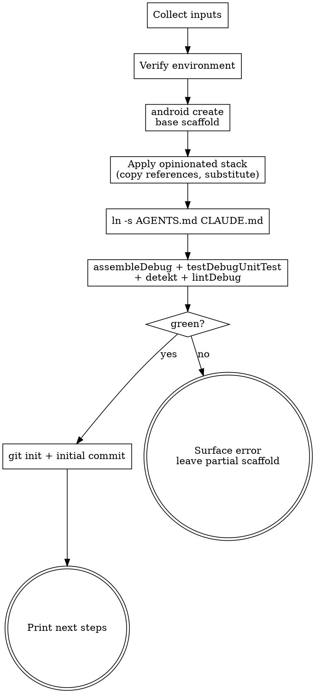

# `new-android-app` Skill — Implementation Plan

> **For agentic workers:** REQUIRED SUB-SKILL: Use superpowers:subagent-driven-development (recommended) or superpowers:executing-plans to implement this plan task-by-task. Steps use checkbox (`- [ ]`) syntax for tracking.

**Goal:** Build a markdown-only skill that scaffolds an opinionated single-module Android app — Metro DI, Compose UI, Circuit (Slack) with native nav, Material You, Coil 3, kermit, Ktor, Crashlytics — with a real `AGENTS.md` + `CLAUDE.md` symlink and `runDebug`/`runRelease` Gradle tasks.

**Architecture:** Skill lives at `skills/new-android-app/`. SKILL.md is the workflow Claude follows. Canonical build files and source templates live in `skills/new-android-app/references/` as real lintable files with `{{placeholder}}` tokens. The skill copies references out, substitutes placeholders, runs `./gradlew assembleDebug test detekt lintDebug`, and commits.

**Tech Stack:** Markdown skill file + Kotlin/Gradle reference templates. No runtime code in this repo — the references are emitted into a generated project.

**Spec:** `docs/superpowers/specs/2026-04-25-new-android-app-skill-design.md`

**Honesty caveat for the implementer:** Several library version pins and Gradle DSL patterns below are written to my best knowledge. After Task 3 and Task 14 you must run a real `./gradlew :app:assembleDebug` against a sandbox and fix version / API drift before continuing. The end-to-end smoke test in Task 29 is the real gate.

---

### Task 1: Create skill directory and SKILL.md skeleton

**Files:**
- Create: `skills/new-android-app/SKILL.md`
- Create: `skills/new-android-app/references/` (directory)

- [ ] **Step 1: Create the directory**

Run:
```bash
mkdir -p /Users/mmckenna/Dev/skills/skills/new-android-app/references
```

- [ ] **Step 2: Write the SKILL.md skeleton**

Create `skills/new-android-app/SKILL.md` with frontmatter and section headers only — content fills in at Task 28:

```markdown
---
name: new-android-app
description: Use when the user wants to scaffold, bootstrap, or create a new Android project from scratch. Produces an opinionated single-module Compose app with Metro DI, Circuit (Slack) state/architecture, Material You theming, Coil 3 images, kermit logging, Ktor networking, and Firebase Crashlytics — plus a CLAUDE.md/AGENTS.md pair and ergonomic runDebug/runRelease Gradle tasks.
---

# Create a new Android app

(Workflow filled in at Task 28.)
```

- [ ] **Step 3: Verify the file exists**

Run:
```bash
ls /Users/mmckenna/Dev/skills/skills/new-android-app/
```
Expected: `SKILL.md  references`

- [ ] **Step 4: Commit**

```bash
cd /Users/mmckenna/Dev/skills && \
git add skills/new-android-app/SKILL.md && \
git commit -m "Scaffold new-android-app skill directory"
```

---

### Task 2: Set up a sandbox project and inventory `android create` output

**Files:**
- No skill files — this task captures information for later tasks.

- [ ] **Step 1: List available templates**

Run:
```bash
android create --list
```
Capture the output. The skill will use the simplest Compose-capable template. Common candidates: `empty-activity`, `compose-empty`, `empty-compose`. Pick the most minimal that includes Compose. If none include Compose, pick the most minimal and the convention plugins will add Compose.

- [ ] **Step 2: Scaffold a sandbox app**

```bash
mkdir -p /tmp/skill-sandbox && \
cd /tmp/skill-sandbox && \
android create empty-activity --name="Sandbox" --output=./sandbox --minSdk=26
```
Replace `empty-activity` with the chosen template name from Step 1.

- [ ] **Step 3: Capture the file tree**

```bash
find /tmp/skill-sandbox/sandbox -maxdepth 6 -type f \
  -not -path '*/build/*' -not -path '*/.gradle/*' -not -path '*/.idea/*' \
  | sort
```
Record this list as the "baseline files produced by `android create`". Each will be either kept, overwritten, or deleted by step 4 of the skill workflow.

- [ ] **Step 4: Note baseline package name and AGP version**

```bash
grep -E 'namespace|applicationId|agp|androidGradlePlugin' \
  /tmp/skill-sandbox/sandbox/app/build.gradle.kts \
  /tmp/skill-sandbox/sandbox/gradle/libs.versions.toml 2>/dev/null
```
Record: the AGP version the template uses, and the namespace pattern. The skill must overwrite both.

- [ ] **Step 5: Confirm the baseline builds**

```bash
cd /tmp/skill-sandbox/sandbox && \
./gradlew -q --console=plain :app:assembleDebug
```
Expected: BUILD SUCCESSFUL. If it fails, the chosen template is broken — try a different one and update the skill.

- [ ] **Step 6: Record the chosen template name**

Hold the chosen template name for use in Task 28's SKILL.md. No commit needed (no skill files changed).

---

### Task 3: Write `libs.versions.toml`

**Files:**
- Create: `skills/new-android-app/references/libs.versions.toml`

- [ ] **Step 1: Write the version catalog**

Create the file with these contents. Versions are pinned to my best-known stable values as of the plan date — Step 2 verifies them.

```toml
[versions]
# Toolchain
kotlin = "2.2.0"
agp = "8.7.0"
ksp = "2.2.0-1.0.27"
javaToolchain = "21"

# Compose
composeBom = "2025.04.00"

# DI
metro = "0.5.0"

# Architecture
circuit = "0.27.0"

# Images
coil = "3.1.0"

# Logging
kermit = "2.0.5"

# Networking
ktor = "3.1.0"
kotlinxSerialization = "1.7.3"
kotlinxCoroutines = "1.9.0"
kotlinxDatetime = "0.6.1"

# Persistence
datastore = "1.1.1"

# Android core
androidxCore = "1.13.1"
androidxCoreSplashscreen = "1.0.1"
androidxActivity = "1.9.3"
androidxLifecycle = "2.8.7"

# Firebase
firebaseBom = "33.7.0"
googleServices = "4.4.2"
crashlyticsPlugin = "3.0.2"

# Testing
junit5 = "5.11.4"
junit5Android = "1.11.2"
turbine = "1.2.0"
kotest = "5.9.1"
robolectric = "4.14"
roborazzi = "1.32.0"
composeUiTest = "1.7.6"

# Quality
detekt = "1.23.7"
ktlint = "12.1.2"
leakcanary = "2.14"

[libraries]
# Compose
androidx-compose-bom = { group = "androidx.compose", name = "compose-bom", version.ref = "composeBom" }
androidx-compose-ui = { group = "androidx.compose.ui", name = "ui" }
androidx-compose-ui-tooling = { group = "androidx.compose.ui", name = "ui-tooling" }
androidx-compose-ui-tooling-preview = { group = "androidx.compose.ui", name = "ui-tooling-preview" }
androidx-compose-material3 = { group = "androidx.compose.material3", name = "material3" }
androidx-compose-foundation = { group = "androidx.compose.foundation", name = "foundation" }
androidx-compose-runtime = { group = "androidx.compose.runtime", name = "runtime" }
androidx-compose-ui-test-junit4 = { group = "androidx.compose.ui", name = "ui-test-junit4-android" }
androidx-compose-ui-test-manifest = { group = "androidx.compose.ui", name = "ui-test-manifest" }

# Activity / Lifecycle / Splash
androidx-core = { group = "androidx.core", name = "core-ktx", version.ref = "androidxCore" }
androidx-core-splashscreen = { group = "androidx.core", name = "core-splashscreen", version.ref = "androidxCoreSplashscreen" }
androidx-activity-compose = { group = "androidx.activity", name = "activity-compose", version.ref = "androidxActivity" }
androidx-lifecycle-runtime-ktx = { group = "androidx.lifecycle", name = "lifecycle-runtime-ktx", version.ref = "androidxLifecycle" }

# Circuit
circuit-foundation = { group = "com.slack.circuit", name = "circuit-foundation", version.ref = "circuit" }
circuit-runtime = { group = "com.slack.circuit", name = "circuit-runtime", version.ref = "circuit" }
circuit-test = { group = "com.slack.circuit", name = "circuit-test", version.ref = "circuit" }

# Metro
metro-runtime = { group = "dev.zacsweers.metro", name = "runtime", version.ref = "metro" }

# Coil 3
coil-compose = { group = "io.coil-kt.coil3", name = "coil-compose", version.ref = "coil" }
coil-network-ktor = { group = "io.coil-kt.coil3", name = "coil-network-ktor3", version.ref = "coil" }

# kermit
kermit = { group = "co.touchlab", name = "kermit", version.ref = "kermit" }
kermit-crashlytics = { group = "co.touchlab", name = "kermit-crashlytics", version.ref = "kermit" }

# Ktor
ktor-client-core = { group = "io.ktor", name = "ktor-client-core", version.ref = "ktor" }
ktor-client-okhttp = { group = "io.ktor", name = "ktor-client-okhttp", version.ref = "ktor" }
ktor-client-content-negotiation = { group = "io.ktor", name = "ktor-client-content-negotiation", version.ref = "ktor" }
ktor-serialization-json = { group = "io.ktor", name = "ktor-serialization-kotlinx-json", version.ref = "ktor" }
ktor-client-logging = { group = "io.ktor", name = "ktor-client-logging", version.ref = "ktor" }

# kotlinx
kotlinx-serialization-json = { group = "org.jetbrains.kotlinx", name = "kotlinx-serialization-json", version.ref = "kotlinxSerialization" }
kotlinx-coroutines-android = { group = "org.jetbrains.kotlinx", name = "kotlinx-coroutines-android", version.ref = "kotlinxCoroutines" }
kotlinx-coroutines-test = { group = "org.jetbrains.kotlinx", name = "kotlinx-coroutines-test", version.ref = "kotlinxCoroutines" }
kotlinx-datetime = { group = "org.jetbrains.kotlinx", name = "kotlinx-datetime", version.ref = "kotlinxDatetime" }

# DataStore
androidx-datastore-preferences = { group = "androidx.datastore", name = "datastore-preferences", version.ref = "datastore" }

# Firebase
firebase-bom = { group = "com.google.firebase", name = "firebase-bom", version.ref = "firebaseBom" }
firebase-crashlytics = { group = "com.google.firebase", name = "firebase-crashlytics-ktx" }
firebase-analytics = { group = "com.google.firebase", name = "firebase-analytics-ktx" }

# Tests
junit-jupiter-api = { group = "org.junit.jupiter", name = "junit-jupiter-api", version.ref = "junit5" }
junit-jupiter-engine = { group = "org.junit.jupiter", name = "junit-jupiter-engine", version.ref = "junit5" }
junit-jupiter-params = { group = "org.junit.jupiter", name = "junit-jupiter-params", version.ref = "junit5" }
turbine = { group = "app.cash.turbine", name = "turbine", version.ref = "turbine" }
kotest-assertions = { group = "io.kotest", name = "kotest-assertions-core", version.ref = "kotest" }
robolectric = { group = "org.robolectric", name = "robolectric", version.ref = "robolectric" }
roborazzi = { group = "io.github.takahirom.roborazzi", name = "roborazzi", version.ref = "roborazzi" }
roborazzi-compose = { group = "io.github.takahirom.roborazzi", name = "roborazzi-compose", version.ref = "roborazzi" }
roborazzi-junit-rule = { group = "io.github.takahirom.roborazzi", name = "roborazzi-junit-rule", version.ref = "roborazzi" }

# Debug-only
leakcanary = { group = "com.squareup.leakcanary", name = "leakcanary-android", version.ref = "leakcanary" }

# build-logic classpath
android-gradle-plugin = { group = "com.android.tools.build", name = "gradle", version.ref = "agp" }
kotlin-gradle-plugin = { group = "org.jetbrains.kotlin", name = "kotlin-gradle-plugin", version.ref = "kotlin" }
ksp-gradle-plugin = { group = "com.google.devtools.ksp", name = "com.google.devtools.ksp.gradle.plugin", version.ref = "ksp" }

[plugins]
android-application = { id = "com.android.application", version.ref = "agp" }
android-library = { id = "com.android.library", version.ref = "agp" }
kotlin-android = { id = "org.jetbrains.kotlin.android", version.ref = "kotlin" }
kotlin-jvm = { id = "org.jetbrains.kotlin.jvm", version.ref = "kotlin" }
kotlin-compose = { id = "org.jetbrains.kotlin.plugin.compose", version.ref = "kotlin" }
kotlin-serialization = { id = "org.jetbrains.kotlin.plugin.serialization", version.ref = "kotlin" }
kotlin-parcelize = { id = "org.jetbrains.kotlin.plugin.parcelize", version.ref = "kotlin" }
ksp = { id = "com.google.devtools.ksp", version.ref = "ksp" }
metro = { id = "dev.zacsweers.metro", version.ref = "metro" }
google-services = { id = "com.google.gms.google-services", version.ref = "googleServices" }
firebase-crashlytics = { id = "com.google.firebase.crashlytics", version.ref = "crashlyticsPlugin" }
detekt = { id = "io.gitlab.arturbosch.detekt", version.ref = "detekt" }
ktlint = { id = "org.jlleitschuh.gradle.ktlint", version.ref = "ktlint" }
roborazzi = { id = "io.github.takahirom.roborazzi", version.ref = "roborazzi" }
```

- [ ] **Step 2: Verify versions resolve**

Run a quick test resolve against a sandbox project (reuse `/tmp/skill-sandbox/sandbox`). Replace its `gradle/libs.versions.toml` with the file above and run:

```bash
cp /Users/mmckenna/Dev/skills/skills/new-android-app/references/libs.versions.toml \
   /tmp/skill-sandbox/sandbox/gradle/libs.versions.toml && \
cd /tmp/skill-sandbox/sandbox && \
./gradlew -q --console=plain :app:dependencies > /tmp/dep-resolve.log 2>&1; \
echo "exit=$?"
```

Expected: exit=0, no `Could not find <coordinate>` errors. If any version is wrong, look up the latest stable on Maven Central and update the catalog.

- [ ] **Step 3: Commit**

```bash
cd /Users/mmckenna/Dev/skills && \
git add skills/new-android-app/references/libs.versions.toml && \
git commit -m "Add libs.versions.toml reference for new-android-app skill"
```

---

### Task 4: Write `settings.gradle.kts.tmpl`

**Files:**
- Create: `skills/new-android-app/references/settings.gradle.kts.tmpl`

- [ ] **Step 1: Write the file**

```kotlin
@file:Suppress("UnstableApiUsage")

pluginManagement {
    includeBuild("build-logic")
    repositories {
        google {
            content {
                includeGroupByRegex("com\\.android.*")
                includeGroupByRegex("com\\.google.*")
                includeGroupByRegex("androidx.*")
            }
        }
        mavenCentral()
        gradlePluginPortal()
    }
}

dependencyResolutionManagement {
    repositoriesMode.set(RepositoriesMode.FAIL_ON_PROJECT_REPOS)
    repositories {
        google()
        mavenCentral()
    }
}

rootProject.name = "{{appNameSnake}}"

include(":app")
```

- [ ] **Step 2: Commit**

```bash
cd /Users/mmckenna/Dev/skills && \
git add skills/new-android-app/references/settings.gradle.kts.tmpl && \
git commit -m "Add settings.gradle.kts template"
```

---

### Task 5: Write root `build.gradle.kts`

**Files:**
- Create: `skills/new-android-app/references/root.build.gradle.kts`

- [ ] **Step 1: Write the file**

```kotlin
plugins {
    alias(libs.plugins.android.application) apply false
    alias(libs.plugins.android.library) apply false
    alias(libs.plugins.kotlin.android) apply false
    alias(libs.plugins.kotlin.compose) apply false
    alias(libs.plugins.kotlin.serialization) apply false
    alias(libs.plugins.kotlin.parcelize) apply false
    alias(libs.plugins.ksp) apply false
    alias(libs.plugins.metro) apply false
    alias(libs.plugins.google.services) apply false
    alias(libs.plugins.firebase.crashlytics) apply false
    alias(libs.plugins.detekt) apply false
    alias(libs.plugins.ktlint) apply false
    alias(libs.plugins.roborazzi) apply false
}
```

- [ ] **Step 2: Commit**

```bash
cd /Users/mmckenna/Dev/skills && \
git add skills/new-android-app/references/root.build.gradle.kts && \
git commit -m "Add root build.gradle.kts reference"
```

---

### Task 6: Write `.gitignore` and `.editorconfig`

**Files:**
- Create: `skills/new-android-app/references/gitignore`
- Create: `skills/new-android-app/references/editorconfig`

- [ ] **Step 1: Write `gitignore`**

(File name has no leading dot in the references dir; the skill renames on copy.)

```gitignore
# Gradle
.gradle/
build/
*.hprof

# IntelliJ / Android Studio
.idea/
*.iml
local.properties
captures/

# Build outputs
*.apk
*.aab
*.dex
*.class

# OS
.DS_Store
Thumbs.db

# Firebase / signing
app/google-services.json
*.keystore
*.jks
release.properties

# Roborazzi snapshots in CI artifacts dir
build/outputs/roborazzi/
```

- [ ] **Step 2: Write `editorconfig`**

```ini
root = true

[*]
charset = utf-8
end_of_line = lf
insert_final_newline = true
trim_trailing_whitespace = true
indent_style = space
indent_size = 4

[*.{kt,kts}]
ij_kotlin_imports_layout = *,java.**,javax.**,kotlin.**,^

[*.{yml,yaml,toml,md}]
indent_size = 2

[Makefile]
indent_style = tab
```

- [ ] **Step 3: Commit**

```bash
cd /Users/mmckenna/Dev/skills && \
git add skills/new-android-app/references/gitignore \
        skills/new-android-app/references/editorconfig && \
git commit -m "Add gitignore and editorconfig references"
```

---

### Task 7: Set up `build-logic` included build

**Files:**
- Create: `skills/new-android-app/references/build-logic/settings.gradle.kts`
- Create: `skills/new-android-app/references/build-logic/convention/build.gradle.kts`

- [ ] **Step 1: Write `build-logic/settings.gradle.kts`**

```kotlin
@file:Suppress("UnstableApiUsage")

dependencyResolutionManagement {
    repositories {
        google()
        mavenCentral()
        gradlePluginPortal()
    }
    versionCatalogs {
        create("libs") {
            from(files("../gradle/libs.versions.toml"))
        }
    }
}

rootProject.name = "build-logic"
include(":convention")
```

- [ ] **Step 2: Write `build-logic/convention/build.gradle.kts`**

```kotlin
plugins {
    `kotlin-dsl`
}

group = "{{packageName}}.buildlogic"

java {
    toolchain {
        languageVersion.set(JavaLanguageVersion.of(21))
    }
}

dependencies {
    compileOnly(libs.android.gradle.plugin)
    compileOnly(libs.kotlin.gradle.plugin)
    compileOnly(libs.ksp.gradle.plugin)
}

gradlePlugin {
    plugins {
        register("androidApplication") {
            id = "{{packageName}}.android.application"
            implementationClass = "AndroidApplicationConventionPlugin"
        }
        register("compose") {
            id = "{{packageName}}.compose"
            implementationClass = "ComposeConventionPlugin"
        }
        register("circuit") {
            id = "{{packageName}}.circuit"
            implementationClass = "CircuitConventionPlugin"
        }
        register("metro") {
            id = "{{packageName}}.metro"
            implementationClass = "MetroConventionPlugin"
        }
        register("testing") {
            id = "{{packageName}}.testing"
            implementationClass = "TestingConventionPlugin"
        }
        register("quality") {
            id = "{{packageName}}.quality"
            implementationClass = "QualityConventionPlugin"
        }
    }
}
```

- [ ] **Step 3: Commit**

```bash
cd /Users/mmckenna/Dev/skills && \
git add skills/new-android-app/references/build-logic/ && \
git commit -m "Add build-logic included build for convention plugins"
```

---

### Task 8: Write `AndroidApplicationConventionPlugin`

**Files:**
- Create: `skills/new-android-app/references/build-logic/convention/src/main/kotlin/AndroidApplicationConventionPlugin.kt`

- [ ] **Step 1: Write the plugin**

```kotlin
import com.android.build.gradle.internal.dsl.BaseAppModuleExtension
import org.gradle.api.Plugin
import org.gradle.api.Project
import org.gradle.api.artifacts.VersionCatalogsExtension
import org.gradle.api.plugins.JavaPluginExtension
import org.gradle.jvm.toolchain.JavaLanguageVersion
import org.gradle.kotlin.dsl.configure
import org.gradle.kotlin.dsl.getByType
import org.jetbrains.kotlin.gradle.dsl.JvmTarget
import org.jetbrains.kotlin.gradle.dsl.KotlinAndroidProjectExtension

class AndroidApplicationConventionPlugin : Plugin<Project> {
    override fun apply(target: Project) = with(target) {
        with(pluginManager) {
            apply("com.android.application")
            apply("org.jetbrains.kotlin.android")
            apply("org.jetbrains.kotlin.plugin.parcelize")
        }

        val libs = extensions.getByType<VersionCatalogsExtension>().named("libs")

        extensions.configure<BaseAppModuleExtension> {
            compileSdk = 35
            defaultConfig {
                minSdk = 26
                targetSdk = 35
                vectorDrawables { useSupportLibrary = true }
            }
            compileOptions {
                sourceCompatibility = org.gradle.api.JavaVersion.VERSION_21
                targetCompatibility = org.gradle.api.JavaVersion.VERSION_21
            }
            buildFeatures { buildConfig = true }
            packaging {
                resources.excludes += setOf(
                    "/META-INF/{AL2.0,LGPL2.1}",
                    "/META-INF/LICENSE*",
                )
            }
        }

        extensions.configure<KotlinAndroidProjectExtension> {
            jvmToolchain(21)
            compilerOptions.jvmTarget.set(JvmTarget.JVM_21)
        }

        extensions.configure<JavaPluginExtension> {
            toolchain.languageVersion.set(JavaLanguageVersion.of(21))
        }
    }
}
```

- [ ] **Step 2: Commit**

```bash
cd /Users/mmckenna/Dev/skills && \
git add skills/new-android-app/references/build-logic/convention/src/main/kotlin/AndroidApplicationConventionPlugin.kt && \
git commit -m "Add AndroidApplicationConventionPlugin"
```

---

### Task 9: Write `ComposeConventionPlugin`

**Files:**
- Create: `skills/new-android-app/references/build-logic/convention/src/main/kotlin/ComposeConventionPlugin.kt`

- [ ] **Step 1: Write the plugin**

```kotlin
import com.android.build.gradle.internal.dsl.BaseAppModuleExtension
import org.gradle.api.Plugin
import org.gradle.api.Project
import org.gradle.api.artifacts.VersionCatalogsExtension
import org.gradle.kotlin.dsl.configure
import org.gradle.kotlin.dsl.dependencies
import org.gradle.kotlin.dsl.getByType

class ComposeConventionPlugin : Plugin<Project> {
    override fun apply(target: Project) = with(target) {
        pluginManager.apply("org.jetbrains.kotlin.plugin.compose")

        extensions.configure<BaseAppModuleExtension> {
            buildFeatures { compose = true }
        }

        val libs = extensions.getByType<VersionCatalogsExtension>().named("libs")

        dependencies {
            val bom = libs.findLibrary("androidx-compose-bom").get()
            add("implementation", platform(bom))
            add("androidTestImplementation", platform(bom))

            listOf(
                "androidx-compose-ui",
                "androidx-compose-ui-tooling-preview",
                "androidx-compose-material3",
                "androidx-compose-foundation",
                "androidx-compose-runtime",
                "androidx-activity-compose",
                "androidx-lifecycle-runtime-ktx",
            ).forEach { add("implementation", libs.findLibrary(it).get()) }

            add("debugImplementation", libs.findLibrary("androidx-compose-ui-tooling").get())
            add("debugImplementation", libs.findLibrary("androidx-compose-ui-test-manifest").get())
        }
    }
}
```

- [ ] **Step 2: Commit**

```bash
cd /Users/mmckenna/Dev/skills && \
git add skills/new-android-app/references/build-logic/convention/src/main/kotlin/ComposeConventionPlugin.kt && \
git commit -m "Add ComposeConventionPlugin"
```

---

### Task 10: Write `MetroConventionPlugin`

**Files:**
- Create: `skills/new-android-app/references/build-logic/convention/src/main/kotlin/MetroConventionPlugin.kt`

- [ ] **Step 1: Write the plugin**

```kotlin
import org.gradle.api.Plugin
import org.gradle.api.Project
import org.gradle.api.artifacts.VersionCatalogsExtension
import org.gradle.kotlin.dsl.dependencies
import org.gradle.kotlin.dsl.getByType

class MetroConventionPlugin : Plugin<Project> {
    override fun apply(target: Project) = with(target) {
        pluginManager.apply("dev.zacsweers.metro")

        val libs = extensions.getByType<VersionCatalogsExtension>().named("libs")

        dependencies {
            add("implementation", libs.findLibrary("metro-runtime").get())
        }
    }
}
```

> **Implementer note:** Verify against Metro's published Gradle plugin docs whether the runtime dependency is added automatically by the plugin (in which case drop the explicit `add("implementation", ...)` line) or must be declared explicitly. Adjust before Task 14's smoke build.

- [ ] **Step 2: Commit**

```bash
cd /Users/mmckenna/Dev/skills && \
git add skills/new-android-app/references/build-logic/convention/src/main/kotlin/MetroConventionPlugin.kt && \
git commit -m "Add MetroConventionPlugin"
```

---

### Task 11: Write `CircuitConventionPlugin`

**Files:**
- Create: `skills/new-android-app/references/build-logic/convention/src/main/kotlin/CircuitConventionPlugin.kt`

- [ ] **Step 1: Write the plugin**

```kotlin
import org.gradle.api.Plugin
import org.gradle.api.Project
import org.gradle.api.artifacts.VersionCatalogsExtension
import org.gradle.kotlin.dsl.dependencies
import org.gradle.kotlin.dsl.getByType

class CircuitConventionPlugin : Plugin<Project> {
    override fun apply(target: Project) = with(target) {
        val libs = extensions.getByType<VersionCatalogsExtension>().named("libs")

        dependencies {
            add("implementation", libs.findLibrary("circuit-foundation").get())
            add("implementation", libs.findLibrary("circuit-runtime").get())
            add("testImplementation", libs.findLibrary("circuit-test").get())
        }
    }
}
```

- [ ] **Step 2: Commit**

```bash
cd /Users/mmckenna/Dev/skills && \
git add skills/new-android-app/references/build-logic/convention/src/main/kotlin/CircuitConventionPlugin.kt && \
git commit -m "Add CircuitConventionPlugin"
```

---

### Task 12: Write `TestingConventionPlugin`

**Files:**
- Create: `skills/new-android-app/references/build-logic/convention/src/main/kotlin/TestingConventionPlugin.kt`

- [ ] **Step 1: Write the plugin**

```kotlin
import com.android.build.gradle.internal.dsl.BaseAppModuleExtension
import org.gradle.api.Plugin
import org.gradle.api.Project
import org.gradle.api.artifacts.VersionCatalogsExtension
import org.gradle.api.tasks.testing.Test
import org.gradle.kotlin.dsl.configure
import org.gradle.kotlin.dsl.dependencies
import org.gradle.kotlin.dsl.getByType
import org.gradle.kotlin.dsl.withType

class TestingConventionPlugin : Plugin<Project> {
    override fun apply(target: Project) = with(target) {
        pluginManager.apply("io.github.takahirom.roborazzi")

        val libs = extensions.getByType<VersionCatalogsExtension>().named("libs")

        extensions.configure<BaseAppModuleExtension> {
            testOptions {
                unitTests {
                    isIncludeAndroidResources = true
                    isReturnDefaultValues = true
                }
            }
        }

        tasks.withType<Test>().configureEach {
            useJUnitPlatform()
        }

        dependencies {
            add("testImplementation", libs.findLibrary("junit-jupiter-api").get())
            add("testImplementation", libs.findLibrary("junit-jupiter-params").get())
            add("testRuntimeOnly", libs.findLibrary("junit-jupiter-engine").get())
            add("testImplementation", libs.findLibrary("turbine").get())
            add("testImplementation", libs.findLibrary("kotest-assertions").get())
            add("testImplementation", libs.findLibrary("robolectric").get())
            add("testImplementation", libs.findLibrary("kotlinx-coroutines-test").get())
            add("testImplementation", libs.findLibrary("roborazzi").get())
            add("testImplementation", libs.findLibrary("roborazzi-compose").get())
            add("testImplementation", libs.findLibrary("roborazzi-junit-rule").get())
            add("androidTestImplementation", libs.findLibrary("androidx-compose-ui-test-junit4").get())
        }
    }
}
```

- [ ] **Step 2: Commit**

```bash
cd /Users/mmckenna/Dev/skills && \
git add skills/new-android-app/references/build-logic/convention/src/main/kotlin/TestingConventionPlugin.kt && \
git commit -m "Add TestingConventionPlugin"
```

---

### Task 13: Write `QualityConventionPlugin`

**Files:**
- Create: `skills/new-android-app/references/build-logic/convention/src/main/kotlin/QualityConventionPlugin.kt`

- [ ] **Step 1: Write the plugin**

```kotlin
import io.gitlab.arturbosch.detekt.extensions.DetektExtension
import org.gradle.api.Plugin
import org.gradle.api.Project
import org.gradle.kotlin.dsl.configure

class QualityConventionPlugin : Plugin<Project> {
    override fun apply(target: Project) = with(target) {
        with(pluginManager) {
            apply("io.gitlab.arturbosch.detekt")
            apply("org.jlleitschuh.gradle.ktlint")
        }

        extensions.configure<DetektExtension> {
            buildUponDefaultConfig = true
            allRules = false
            config.setFrom(rootProject.file("config/detekt/detekt.yml"))
            baseline = rootProject.file("config/detekt/detekt-baseline.xml")
        }
    }
}
```

> **Implementer note:** The detekt extension import path can drift between detekt versions. If compilation fails, run `./gradlew :app:detekt --info` against the sandbox and consult the detekt docs for the correct extension class.

- [ ] **Step 2: Commit**

```bash
cd /Users/mmckenna/Dev/skills && \
git add skills/new-android-app/references/build-logic/convention/src/main/kotlin/QualityConventionPlugin.kt && \
git commit -m "Add QualityConventionPlugin"
```

---

### Task 14: Write `app/build.gradle.kts.tmpl`

**Files:**
- Create: `skills/new-android-app/references/app.build.gradle.kts.tmpl`

- [ ] **Step 1: Write the file**

```kotlin
import java.util.Properties

plugins {
    id("{{packageName}}.android.application")
    id("{{packageName}}.compose")
    id("{{packageName}}.circuit")
    id("{{packageName}}.metro")
    id("{{packageName}}.testing")
    id("{{packageName}}.quality")
    alias(libs.plugins.kotlin.serialization)
    alias(libs.plugins.ksp)
}

apply(from = rootProject.file("gradle/run-tasks.gradle.kts"))

val googleServicesFile = rootProject.file("app/google-services.json")
val crashlyticsEnabled = googleServicesFile.exists()
if (crashlyticsEnabled) {
    apply(plugin = libs.plugins.google.services.get().pluginId)
    apply(plugin = libs.plugins.firebase.crashlytics.get().pluginId)
}

android {
    namespace = "{{packageName}}"

    defaultConfig {
        applicationId = "{{packageName}}"
        versionCode = 1
        versionName = "0.1.0"
        testInstrumentationRunner = "androidx.test.runner.AndroidJUnitRunner"
    }

    signingConfigs {
        getByName("debug") {
            // default debug signing
        }
    }

    buildTypes {
        debug {
            applicationIdSuffix = ".debug"
            isDebuggable = true
            isMinifyEnabled = false
        }
        release {
            isMinifyEnabled = true
            isShrinkResources = true
            proguardFiles(
                getDefaultProguardFile("proguard-android-optimize.txt"),
                "proguard-rules.pro",
            )
            signingConfig = signingConfigs.getByName("debug") // replace with real config
        }
    }
}

dependencies {
    implementation(libs.androidx.core)
    implementation(libs.androidx.core.splashscreen)
    implementation(libs.androidx.datastore.preferences)

    implementation(libs.coil.compose)
    implementation(libs.coil.network.ktor)

    implementation(libs.kermit)
    if (crashlyticsEnabled) {
        implementation(platform(libs.firebase.bom))
        implementation(libs.firebase.crashlytics)
        implementation(libs.firebase.analytics)
        implementation(libs.kermit.crashlytics)
    }

    implementation(libs.ktor.client.core)
    implementation(libs.ktor.client.okhttp)
    implementation(libs.ktor.client.content.negotiation)
    implementation(libs.ktor.serialization.json)
    implementation(libs.ktor.client.logging)

    implementation(libs.kotlinx.serialization.json)
    implementation(libs.kotlinx.coroutines.android)
    implementation(libs.kotlinx.datetime)

    debugImplementation(libs.leakcanary)
}
```

- [ ] **Step 2: Smoke-build against the sandbox**

This is the first time we have enough to actually build. Wire the references into the sandbox and verify.

```bash
SANDBOX=/tmp/skill-sandbox/sandbox
REFS=/Users/mmckenna/Dev/skills/skills/new-android-app/references

# Copy references into sandbox, substituting placeholders.
PKG="com.example.sandbox"
PKG_PATH="com/example/sandbox"
APP="Sandbox"
APP_SNAKE="sandbox"
substitute() { sed -e "s|{{packageName}}|$PKG|g" -e "s|{{packagePath}}|$PKG_PATH|g" -e "s|{{appName}}|$APP|g" -e "s|{{appNameSnake}}|$APP_SNAKE|g" "$1"; }

mkdir -p "$SANDBOX/build-logic/convention/src/main/kotlin"
cp -r "$REFS/build-logic/convention/src/main/kotlin/." "$SANDBOX/build-logic/convention/src/main/kotlin/"
cp "$REFS/build-logic/settings.gradle.kts" "$SANDBOX/build-logic/settings.gradle.kts"
substitute "$REFS/build-logic/convention/build.gradle.kts" > "$SANDBOX/build-logic/convention/build.gradle.kts"

cp "$REFS/libs.versions.toml" "$SANDBOX/gradle/libs.versions.toml"
cp "$REFS/root.build.gradle.kts" "$SANDBOX/build.gradle.kts"
substitute "$REFS/settings.gradle.kts.tmpl" > "$SANDBOX/settings.gradle.kts"
substitute "$REFS/app.build.gradle.kts.tmpl" > "$SANDBOX/app/build.gradle.kts"

cd "$SANDBOX" && ./gradlew -q --console=plain :app:assembleDebug 2>&1 | tail -50
```

Expected: BUILD SUCCESSFUL. If it fails, fix the relevant reference file (most likely a version mismatch in `libs.versions.toml` or a Gradle DSL drift in a convention plugin), re-amend the commit for that task, and retry.

- [ ] **Step 3: Commit (only if smoke build is green)**

```bash
cd /Users/mmckenna/Dev/skills && \
git add skills/new-android-app/references/app.build.gradle.kts.tmpl && \
git commit -m "Add app.build.gradle.kts template (smoke-build verified)"
```

---

### Task 15: Write `run-tasks.gradle.kts`

**Files:**
- Create: `skills/new-android-app/references/run-tasks.gradle.kts`

- [ ] **Step 1: Write the file**

```kotlin
// Registers runDebug / runRelease / runDebugAll / runReleaseAll tasks.
// Each assembles + installs + launches the main activity via adb.

import org.gradle.api.tasks.Exec

fun adbDevices(): List<String> {
    val proc = ProcessBuilder("adb", "devices").redirectErrorStream(true).start()
    proc.waitFor()
    return proc.inputStream.bufferedReader().readLines()
        .drop(1)
        .mapNotNull { line ->
            val cols = line.trim().split("\\s+".toRegex())
            if (cols.size >= 2 && cols[1] == "device") cols[0] else null
        }
}

fun launchOn(serial: String, applicationId: String): Exec.() -> Unit = {
    commandLine(
        "adb", "-s", serial, "shell", "am", "start", "-n",
        "$applicationId/.MainActivity",
    )
}

listOf("Debug", "Release").forEach { variant ->
    val installTask = "install$variant"
    val singleName = "run${variant}"
    val allName = "run${variant}All"

    tasks.register(singleName) {
        group = "run"
        description = "Assemble, install, and launch the $variant variant on the single connected device."
        dependsOn(installTask)
        doLast {
            val devices = adbDevices()
            check(devices.isNotEmpty()) { "No connected devices. Connect one or run :${allName}." }
            check(devices.size == 1) {
                "${devices.size} devices connected: ${devices.joinToString()}. Use :$allName or disconnect all but one."
            }
            val applicationId = (android as com.android.build.gradle.internal.dsl.BaseAppModuleExtension)
                .defaultConfig.applicationId!! +
                if (variant == "Debug") ".debug" else ""
            exec(launchOn(devices.single(), applicationId))
            logger.lifecycle("Launched $applicationId on ${devices.single()}")
        }
    }

    tasks.register(allName) {
        group = "run"
        description = "Assemble, install, and launch the $variant variant on every connected device."
        dependsOn(installTask)
        doLast {
            val devices = adbDevices()
            check(devices.isNotEmpty()) { "No connected devices." }
            val applicationId = (android as com.android.build.gradle.internal.dsl.BaseAppModuleExtension)
                .defaultConfig.applicationId!! +
                if (variant == "Debug") ".debug" else ""
            devices.forEach { serial ->
                exec(launchOn(serial, applicationId))
                logger.lifecycle("Launched $applicationId on $serial")
            }
        }
    }
}
```

> **Implementer note:** Casting `android` to `BaseAppModuleExtension` from inside an applied script may fail at script-compile time depending on classpath. If it does, fall back to looking up the application id via `project.extensions.getByType(...)` inside the task action. Smoke-test this by running `./gradlew tasks --group run` against the sandbox.

- [ ] **Step 2: Verify the tasks register**

```bash
SANDBOX=/tmp/skill-sandbox/sandbox
REFS=/Users/mmckenna/Dev/skills/skills/new-android-app/references
mkdir -p "$SANDBOX/gradle"
cp "$REFS/run-tasks.gradle.kts" "$SANDBOX/gradle/run-tasks.gradle.kts"
cd "$SANDBOX" && ./gradlew -q --console=plain tasks --group run
```

Expected: shows `runDebug`, `runRelease`, `runDebugAll`, `runReleaseAll`. Fix the script if any are missing.

- [ ] **Step 3: Commit**

```bash
cd /Users/mmckenna/Dev/skills && \
git add skills/new-android-app/references/run-tasks.gradle.kts && \
git commit -m "Add run-tasks.gradle.kts (runDebug/runRelease/All)"
```

---

### Task 16: Write `AppGraph.kt.tmpl` (Metro DI graph)

**Files:**
- Create: `skills/new-android-app/references/AppGraph.kt.tmpl`

- [ ] **Step 1: Write the file**

```kotlin
package {{packageName}}.di

import android.app.Application
import dev.zacsweers.metro.AppScope
import dev.zacsweers.metro.DependencyGraph
import dev.zacsweers.metro.Provides
import io.ktor.client.HttpClient
import io.ktor.client.engine.okhttp.OkHttp
import io.ktor.client.plugins.contentnegotiation.ContentNegotiation
import io.ktor.client.plugins.logging.Logging
import io.ktor.serialization.kotlinx.json.json
import kotlinx.serialization.json.Json
import coil3.ImageLoader
import coil3.PlatformContext
import coil3.network.ktor3.KtorNetworkFetcherFactory
import coil3.request.crossfade

@DependencyGraph(scope = AppScope::class)
interface AppGraph {

    val httpClient: HttpClient
    val imageLoader: ImageLoader
    val json: Json

    @DependencyGraph.Factory
    fun interface Factory {
        fun create(@Provides application: Application): AppGraph
    }

    @Provides
    fun provideJson(): Json = Json {
        ignoreUnknownKeys = true
        explicitNulls = false
    }

    @Provides
    fun provideHttpClient(json: Json): HttpClient = HttpClient(OkHttp) {
        install(ContentNegotiation) { json(json) }
        install(Logging)
    }

    @Provides
    fun provideImageLoader(
        context: PlatformContext,
        httpClient: HttpClient,
    ): ImageLoader = ImageLoader.Builder(context)
        .components { add(KtorNetworkFetcherFactory(httpClient)) }
        .crossfade(true)
        .build()
}
```

> **Implementer note:** Metro's `@DependencyGraph` API is the public surface; double-check the `@Provides` placement (some versions require providers in a separate `@ContributesTo` interface). Adjust based on Metro's published Quickstart sample at the version pinned in `libs.versions.toml`.

- [ ] **Step 2: Commit**

```bash
cd /Users/mmckenna/Dev/skills && \
git add skills/new-android-app/references/AppGraph.kt.tmpl && \
git commit -m "Add AppGraph.kt template (Metro DI)"
```

---

### Task 17: Write `App.kt.tmpl` (Application class)

**Files:**
- Create: `skills/new-android-app/references/App.kt.tmpl`

- [ ] **Step 1: Write the file**

```kotlin
package {{packageName}}

import android.app.Application
import co.touchlab.kermit.Logger
import co.touchlab.kermit.platformLogWriter
import {{packageName}}.di.AppGraph
import {{packageName}}.di.create

class App : Application() {

    lateinit var graph: AppGraph
        private set

    override fun onCreate() {
        super.onCreate()
        installLogging()
        installCrashlyticsIfConfigured()
        graph = AppGraph.Factory().create(this)
    }

    private fun installLogging() {
        Logger.setLogWriters(platformLogWriter())
        Logger.setTag("{{appName}}")
    }

    private fun installCrashlyticsIfConfigured() {
        // Crashlytics auto-initializes via FirebaseInitProvider when google-services.json
        // is present at build time. The plugin's classpath is only on the build when
        // the file exists, so no runtime guard is needed here. If you want kermit logs
        // to flow into Crashlytics, add a CrashlyticsLogWriter from kermit-crashlytics.
    }
}
```

> **Implementer note:** The line `AppGraph.Factory().create(this)` assumes Metro generates a no-arg `Factory` constructor. If your Metro version generates a different entry point (e.g. `DaggerAppGraph.factory()`-style), update accordingly when you fix Task 16.

- [ ] **Step 2: Commit**

```bash
cd /Users/mmckenna/Dev/skills && \
git add skills/new-android-app/references/App.kt.tmpl && \
git commit -m "Add App.kt template (Application class)"
```

---

### Task 18: Write `MainActivity.kt.tmpl`

**Files:**
- Create: `skills/new-android-app/references/MainActivity.kt.tmpl`

- [ ] **Step 1: Write the file**

```kotlin
package {{packageName}}

import android.os.Bundle
import androidx.activity.ComponentActivity
import androidx.activity.compose.setContent
import androidx.activity.enableEdgeToEdge
import androidx.compose.runtime.remember
import androidx.core.splashscreen.SplashScreen.Companion.installSplashScreen
import com.slack.circuit.backstack.rememberSaveableBackStack
import com.slack.circuit.foundation.NavigableCircuitContent
import com.slack.circuit.foundation.rememberCircuitNavigator
import {{packageName}}.circuit.LocalCircuit
import {{packageName}}.circuit.buildCircuit
import {{packageName}}.nav.RootScreen
import {{packageName}}.ui.theme.AppTheme

class MainActivity : ComponentActivity() {
    override fun onCreate(savedInstanceState: Bundle?) {
        installSplashScreen()
        enableEdgeToEdge()
        super.onCreate(savedInstanceState)

        val app = application as App
        val circuit = buildCircuit(app.graph)

        setContent {
            AppTheme {
                val backStack = rememberSaveableBackStack(root = RootScreen)
                val navigator = rememberCircuitNavigator(backStack) { finish() }
                androidx.compose.runtime.CompositionLocalProvider(LocalCircuit provides circuit) {
                    NavigableCircuitContent(
                        navigator = navigator,
                        backStack = backStack,
                    )
                }
            }
        }
    }
}
```

> **Implementer note:** Circuit's API surface for `rememberSaveableBackStack` and `NavigableCircuitContent` has changed across versions. Cross-check with the Circuit docs for the version pinned in `libs.versions.toml`.

- [ ] **Step 2: Commit**

```bash
cd /Users/mmckenna/Dev/skills && \
git add skills/new-android-app/references/MainActivity.kt.tmpl && \
git commit -m "Add MainActivity.kt template (edge-to-edge + splash + Circuit)"
```

---

### Task 19: Write `AndroidManifest.xml.tmpl`

**Files:**
- Create: `skills/new-android-app/references/AndroidManifest.xml.tmpl`

- [ ] **Step 1: Write the file**

```xml
<?xml version="1.0" encoding="utf-8"?>
<manifest xmlns:android="http://schemas.android.com/apk/res/android">

    <uses-permission android:name="android.permission.INTERNET" />

    <application
        android:name=".App"
        android:allowBackup="false"
        android:enableOnBackInvokedCallback="true"
        android:icon="@mipmap/ic_launcher"
        android:label="{{appName}}"
        android:roundIcon="@mipmap/ic_launcher_round"
        android:supportsRtl="true"
        android:theme="@style/Theme.{{appName}}.Splash">

        <activity
            android:name=".MainActivity"
            android:exported="true"
            android:theme="@style/Theme.{{appName}}.Splash">
            <intent-filter>
                <action android:name="android.intent.action.MAIN" />
                <category android:name="android.intent.category.LAUNCHER" />
            </intent-filter>
        </activity>

    </application>

</manifest>
```

> **Implementer note:** The Android 12+ Splash Screen API requires a `Theme.<App>.Splash` style in `res/values/themes.xml`. The `android create` template usually generates this; the skill workflow keeps the generated `themes.xml` and only renames the style if the chosen template uses a different name. Document this dependency in SKILL.md (Task 28).

- [ ] **Step 2: Commit**

```bash
cd /Users/mmckenna/Dev/skills && \
git add skills/new-android-app/references/AndroidManifest.xml.tmpl && \
git commit -m "Add AndroidManifest.xml template"
```

---

### Task 20: Write theme files

**Files:**
- Create: `skills/new-android-app/references/Color.kt.tmpl`
- Create: `skills/new-android-app/references/Type.kt.tmpl`
- Create: `skills/new-android-app/references/Theme.kt.tmpl`

- [ ] **Step 1: Write `Color.kt.tmpl`**

```kotlin
package {{packageName}}.ui.theme

import androidx.compose.ui.graphics.Color

internal val Seed = Color(0xFF6750A4)

internal val LightPrimary = Color(0xFF6750A4)
internal val LightOnPrimary = Color(0xFFFFFFFF)
internal val LightSurface = Color(0xFFFFFBFE)
internal val LightOnSurface = Color(0xFF1C1B1F)

internal val DarkPrimary = Color(0xFFD0BCFF)
internal val DarkOnPrimary = Color(0xFF381E72)
internal val DarkSurface = Color(0xFF1C1B1F)
internal val DarkOnSurface = Color(0xFFE6E1E5)
```

- [ ] **Step 2: Write `Type.kt.tmpl`**

```kotlin
package {{packageName}}.ui.theme

import androidx.compose.material3.Typography

internal val AppTypography = Typography()
```

- [ ] **Step 3: Write `Theme.kt.tmpl`**

```kotlin
package {{packageName}}.ui.theme

import android.os.Build
import androidx.compose.foundation.isSystemInDarkTheme
import androidx.compose.material3.MaterialTheme
import androidx.compose.material3.darkColorScheme
import androidx.compose.material3.dynamicDarkColorScheme
import androidx.compose.material3.dynamicLightColorScheme
import androidx.compose.material3.lightColorScheme
import androidx.compose.runtime.Composable
import androidx.compose.ui.platform.LocalContext

private val DarkColors = darkColorScheme(
    primary = DarkPrimary,
    onPrimary = DarkOnPrimary,
    surface = DarkSurface,
    onSurface = DarkOnSurface,
)

private val LightColors = lightColorScheme(
    primary = LightPrimary,
    onPrimary = LightOnPrimary,
    surface = LightSurface,
    onSurface = LightOnSurface,
)

@Composable
fun AppTheme(
    darkTheme: Boolean = isSystemInDarkTheme(),
    dynamicColor: Boolean = true,
    content: @Composable () -> Unit,
) {
    val colorScheme = when {
        dynamicColor && Build.VERSION.SDK_INT >= Build.VERSION_CODES.S -> {
            val context = LocalContext.current
            if (darkTheme) dynamicDarkColorScheme(context) else dynamicLightColorScheme(context)
        }
        darkTheme -> DarkColors
        else -> LightColors
    }
    MaterialTheme(
        colorScheme = colorScheme,
        typography = AppTypography,
        content = content,
    )
}
```

- [ ] **Step 4: Commit**

```bash
cd /Users/mmckenna/Dev/skills && \
git add skills/new-android-app/references/Color.kt.tmpl \
        skills/new-android-app/references/Type.kt.tmpl \
        skills/new-android-app/references/Theme.kt.tmpl && \
git commit -m "Add Material You theme templates"
```

---

### Task 21: Write Circuit registry and `RootScreen`

**Files:**
- Create: `skills/new-android-app/references/CircuitConfig.kt.tmpl`
- Create: `skills/new-android-app/references/RootScreen.kt.tmpl`

- [ ] **Step 1: Write `CircuitConfig.kt.tmpl`**

```kotlin
package {{packageName}}.circuit

import androidx.compose.runtime.staticCompositionLocalOf
import com.slack.circuit.foundation.Circuit
import {{packageName}}.di.AppGraph
import {{packageName}}.nav.RootPresenterFactory
import {{packageName}}.nav.RootUiFactory

val LocalCircuit = staticCompositionLocalOf<Circuit> {
    error("Circuit not initialized")
}

fun buildCircuit(graph: AppGraph): Circuit = Circuit.Builder()
    .addPresenterFactory(RootPresenterFactory())
    .addUiFactory(RootUiFactory())
    .build()
```

- [ ] **Step 2: Write `RootScreen.kt.tmpl`**

```kotlin
package {{packageName}}.nav

import androidx.compose.foundation.layout.Box
import androidx.compose.foundation.layout.fillMaxSize
import androidx.compose.runtime.Composable
import androidx.compose.runtime.remember
import androidx.compose.ui.Modifier
import com.slack.circuit.runtime.CircuitContext
import com.slack.circuit.runtime.Navigator
import com.slack.circuit.runtime.presenter.Presenter
import com.slack.circuit.runtime.screen.Screen
import com.slack.circuit.runtime.ui.Ui
import com.slack.circuit.runtime.ui.ui
import kotlinx.parcelize.Parcelize

@Parcelize
data object RootScreen : Screen {
    data class State(val placeholder: String = "TODO: first feature") :
        com.slack.circuit.runtime.CircuitUiState
}

class RootPresenter : Presenter<RootScreen.State> {
    @Composable
    override fun present(): RootScreen.State = remember { RootScreen.State() }
}

class RootPresenterFactory : Presenter.Factory {
    override fun create(screen: Screen, navigator: Navigator, context: CircuitContext): Presenter<*>? =
        when (screen) {
            is RootScreen -> RootPresenter()
            else -> null
        }
}

@Composable
fun Root(state: RootScreen.State, modifier: Modifier = Modifier) {
    // Empty scaffold. First feature replaces this.
    Box(modifier = modifier.fillMaxSize())
}

class RootUiFactory : Ui.Factory {
    override fun create(screen: Screen, context: CircuitContext): Ui<*>? =
        when (screen) {
            is RootScreen -> ui<RootScreen.State> { state, modifier -> Root(state, modifier) }
            else -> null
        }
}
```

> **Implementer note:** `@Parcelize` is provided by the kotlin-parcelize plugin, which is wired into the application convention plugin (Task 8) and version catalog (Task 3). If Circuit's `Screen` interface drops the `Parcelable` requirement at the version you're using, you can simplify by removing `@Parcelize` — but leave it for now; it's harmless on Android.

- [ ] **Step 3: Commit**

```bash
cd /Users/mmckenna/Dev/skills && \
git add skills/new-android-app/references/CircuitConfig.kt.tmpl \
        skills/new-android-app/references/RootScreen.kt.tmpl && \
git commit -m "Add Circuit config and RootScreen templates"
```

---

### Task 22: Write `ExampleTest.kt.tmpl`

**Files:**
- Create: `skills/new-android-app/references/ExampleTest.kt.tmpl`

- [ ] **Step 1: Write the file**

```kotlin
package {{packageName}}

import io.kotest.matchers.shouldBe
import org.junit.jupiter.api.Test

class ExampleTest {
    @Test
    fun `kotest assertions work`() {
        (1 + 1) shouldBe 2
    }
}
```

- [ ] **Step 2: Commit**

```bash
cd /Users/mmckenna/Dev/skills && \
git add skills/new-android-app/references/ExampleTest.kt.tmpl && \
git commit -m "Add ExampleTest template"
```

---

### Task 23: Write `RootPresenterTest.kt.tmpl`

**Files:**
- Create: `skills/new-android-app/references/RootPresenterTest.kt.tmpl`

- [ ] **Step 1: Write the file**

```kotlin
package {{packageName}}.nav

import com.slack.circuit.test.test
import io.kotest.matchers.shouldBe
import kotlinx.coroutines.test.runTest
import org.junit.jupiter.api.Test

class RootPresenterTest {

    @Test
    fun `initial state is placeholder`() = runTest {
        RootPresenter().test {
            val state = awaitItem()
            state.placeholder shouldBe "TODO: first feature"
        }
    }
}
```

- [ ] **Step 2: Commit**

```bash
cd /Users/mmckenna/Dev/skills && \
git add skills/new-android-app/references/RootPresenterTest.kt.tmpl && \
git commit -m "Add RootPresenterTest template (circuit-test)"
```

---

### Task 24: Write `ThemeScreenshotTest.kt.tmpl`

**Files:**
- Create: `skills/new-android-app/references/ThemeScreenshotTest.kt.tmpl`

- [ ] **Step 1: Write the file**

```kotlin
package {{packageName}}.ui.theme

import androidx.compose.foundation.layout.Box
import androidx.compose.foundation.layout.fillMaxSize
import androidx.compose.material3.MaterialTheme
import androidx.compose.material3.Surface
import androidx.compose.material3.Text
import androidx.compose.ui.Modifier
import androidx.compose.ui.test.junit4.createComposeRule
import com.github.takahirom.roborazzi.captureRoboImage
import org.junit.Rule
import org.junit.runner.RunWith
import org.junit.jupiter.api.Test
import org.robolectric.RobolectricTestRunner
import org.robolectric.annotation.Config
import org.robolectric.annotation.GraphicsMode

@RunWith(RobolectricTestRunner::class)
@GraphicsMode(GraphicsMode.Mode.NATIVE)
@Config(qualifiers = "w360dp-h640dp")
class ThemeScreenshotTest {

    @get:Rule
    val composeRule = createComposeRule()

    @Test
    fun lightTheme_smoke() {
        composeRule.setContent {
            AppTheme(darkTheme = false, dynamicColor = false) {
                Surface(modifier = Modifier.fillMaxSize()) {
                    Text("Hello", style = MaterialTheme.typography.titleLarge)
                }
            }
        }
        composeRule.onRoot().captureRoboImage()
    }
}
```

> **Implementer note:** Roborazzi + JUnit5 mixing requires `roborazzi-junit-rule`. Some setups still default to JUnit4 for Robolectric — if `@RunWith(RobolectricTestRunner::class)` clashes with Jupiter, swap to JUnit4 (`org.junit.Test`, `org.junit.runner.RunWith`) only for this test, and configure the test source set accordingly in TestingConventionPlugin.

- [ ] **Step 2: Commit**

```bash
cd /Users/mmckenna/Dev/skills && \
git add skills/new-android-app/references/ThemeScreenshotTest.kt.tmpl && \
git commit -m "Add ThemeScreenshotTest template (Roborazzi)"
```

---

### Task 25: Write `AGENTS.md.tmpl`

**Files:**
- Create: `skills/new-android-app/references/AGENTS.md.tmpl`

- [ ] **Step 1: Write the file**

```markdown
# {{appName}} — Architecture

This app uses an opinionated stack. Follow these conventions before making changes.

## Stack

- **DI**: Metro (`dev.zacsweers.metro`). Graphs declared in `*/di/`. Do not introduce Dagger/Hilt/Koin/Anvil.
- **UI**: Jetpack Compose only. No XML layouts. No View-system widgets.
- **Architecture**: Circuit (`com.slack.circuit`). Each feature = one `Screen` + `Presenter` + UI composable. Unidirectional: UI emits `Event`, presenter returns `State`.
- **Navigation**: Circuit-native (`Navigator`, `BackStack`, `NavigableCircuitContent`). Do not add AndroidX Compose Navigation.
- **Theme**: Material 3 with dynamic color (Material You) on Android 12+, fallback palette otherwise. Edits go in `ui/theme/`.
- **Images**: Coil 3. Use the injected `ImageLoader` from the Metro graph; do not construct your own.
- **Logging**: kermit (`co.touchlab.kermit`). Use the lazy lambda form: `Logger.d { "..." }`. Do not use `android.util.Log` or println.
- **Networking**: Ktor client (provided through Metro).
- **Persistence**: DataStore (preferences).
- **Concurrency**: kotlinx.coroutines. Inject `CoroutineDispatcher`s where needed; do not call `Dispatchers.IO` directly in production code.
- **Crashes**: Firebase Crashlytics. Activated when `app/google-services.json` is present at build time; the project still builds without it.

## Adding a feature

1. Define `data object FooScreen : Screen` with `data class State(...) : CircuitUiState` and a `sealed interface Event`.
2. Write `class FooPresenter @Inject constructor(...) : Presenter<FooScreen.State>`.
3. Write `@Composable fun Foo(state: FooScreen.State, modifier: Modifier)`.
4. Bind both into the Circuit registry in `circuit/CircuitConfig.kt`.
5. Add a presenter test using `circuit-test` (`Presenter.test { ... }`).

## Running

- `./gradlew runDebug` — assemble + install + launch on the single connected device.
- `./gradlew runDebugAll` — same, on every connected device/emulator.
- Replace `Debug` with `Release` for release variants.

## Testing

- Unit: JUnit5 + Kotest assertions + Turbine.
- Presenter: `circuit-test`.
- Compose UI: `androidx.compose.ui.test`.
- Screenshots: Roborazzi (`./gradlew recordRoborazziDebug` to update goldens).

## Crashlytics setup

1. Create a Firebase project at <https://console.firebase.google.com>.
2. Add an Android app with package `{{packageName}}`.
3. Download `google-services.json` and place it at `app/google-services.json` (gitignored).
4. Rebuild — Crashlytics activates automatically.

## What not to do

- Don't add a second DI framework, nav library, image loader, or logger.
- Don't bypass Metro to call `new` on classes that have a graph binding.
- Don't put business logic in composables — it belongs in the Presenter.
- Don't commit `app/google-services.json` or any signing key.
```

- [ ] **Step 2: Commit**

```bash
cd /Users/mmckenna/Dev/skills && \
git add skills/new-android-app/references/AGENTS.md.tmpl && \
git commit -m "Add AGENTS.md template"
```

---

### Task 26: Write `detekt.yml`, `ci.yml`, `google-services.json.example`

**Files:**
- Create: `skills/new-android-app/references/detekt.yml`
- Create: `skills/new-android-app/references/ci.yml`
- Create: `skills/new-android-app/references/google-services.json.example`

- [ ] **Step 1: Write `detekt.yml`**

```yaml
build:
  maxIssues: 0

complexity:
  LongMethod:
    threshold: 80
  TooManyFunctions:
    active: false

style:
  MagicNumber:
    ignoreNumbers: ['-1', '0', '1', '2', '100']
  WildcardImport:
    active: true
  MaxLineLength:
    maxLineLength: 120

naming:
  FunctionNaming:
    functionPattern: '[a-zA-Z][a-zA-Z0-9]*'
```

- [ ] **Step 2: Write `ci.yml`**

```yaml
name: CI

on:
  push:
    branches: [main]
  pull_request:

jobs:
  build:
    runs-on: ubuntu-latest
    steps:
      - uses: actions/checkout@v4
      - uses: actions/setup-java@v4
        with:
          distribution: 'temurin'
          java-version: '21'
      - uses: gradle/actions/setup-gradle@v4
      - name: Assemble
        run: ./gradlew --no-daemon -q --console=plain :app:assembleDebug
      - name: Unit tests
        run: ./gradlew --no-daemon -q --console=plain :app:testDebugUnitTest
      - name: Quality gates
        run: ./gradlew --no-daemon -q --console=plain :app:detekt :app:lintDebug
```

- [ ] **Step 3: Write `google-services.json.example`**

```json
{
  "_comment": "REPLACE THIS FILE: Download the real google-services.json from Firebase console and save it as app/google-services.json (it is gitignored). See AGENTS.md for setup steps."
}
```

- [ ] **Step 4: Commit**

```bash
cd /Users/mmckenna/Dev/skills && \
git add skills/new-android-app/references/detekt.yml \
        skills/new-android-app/references/ci.yml \
        skills/new-android-app/references/google-services.json.example && \
git commit -m "Add detekt, CI, and google-services placeholder references"
```

---

### Task 27: Write the SKILL.md workflow

**Files:**
- Modify: `skills/new-android-app/SKILL.md` (replace the skeleton from Task 1)

- [ ] **Step 1: Replace SKILL.md with the full workflow**

```markdown
---
name: new-android-app
description: Use when the user wants to scaffold, bootstrap, or create a new Android project from scratch. Produces an opinionated single-module Compose app with Metro DI, Circuit (Slack) state/architecture, Material You theming, Coil 3 images, kermit logging, Ktor networking, and Firebase Crashlytics — plus a CLAUDE.md/AGENTS.md pair and ergonomic runDebug/runRelease Gradle tasks.
---

# Create a new Android app

Scaffolds a single-module Android app with a locked-in stack, then verifies it builds, tests, and lints cleanly. The end state is an empty scaffold (no demo screens) ready for the user to write their first Circuit feature.

## What this skill produces

- Single-module app at `<output>/<appNameSnake>/`
- Compose-only, Circuit-native nav, blank start screen
- Metro DI graph, Material You theme, edge-to-edge, Core SplashScreen, predictive back
- Coil 3 `ImageLoader` provided through Metro, kermit logger, Ktor client
- Crashlytics pre-wired, gated on `app/google-services.json` presence
- `runDebug` / `runRelease` / `runDebugAll` / `runReleaseAll` Gradle tasks
- `AGENTS.md` (real file) + `CLAUDE.md` (symlink)
- `.github/workflows/ci.yml`, detekt + ktlint, Roborazzi screenshot tests
- Commit `Initial scaffold via new-android-app skill`

## Workflow



### Step 1 — Collect inputs

Ask the user, one prompt at a time:

1. **App display name** (e.g. `Halogen`).
2. **Package name** (e.g. `me.mmckenna.halogen`). Validate against `^[a-z][a-z0-9_]*(\.[a-z][a-z0-9_]*)+$`. Reject and re-prompt on failure.
3. **Output directory** (default: current working directory).
4. **Min SDK** (default: 26).
5. **Initialize git?** (default: yes).

Derive:
- `appNameSnake` = display name lowercased, non-alphanumerics → `_`.
- `packagePath` = package name with `.` → `/`.
- `targetSdk` = highest installed platform from `android sdk list --installed`.

### Step 2 — Verify environment

Run, in this order, and stop on the first failure with a user-facing message:

```bash
which android         # android CLI present?
java -version         # JDK 21+?
android sdk list --installed    # at least one platform + build-tools?
```

If `android` is missing, point the user at the `android-cli` skill's setup notes. If JDK is missing or older, suggest `sdkman install java 21-tem` or equivalent.

### Step 3 — Scaffold base via `android create`

Pick the simplest Compose-capable template. Run `android create --list` if unsure. Default template: **<TEMPLATE_NAME_FROM_TASK_2>**.

```bash
android create <TEMPLATE_NAME> --name="<App Display Name>" --output=<output> --minSdk=<minSdk>
```

This produces a buildable starting point. The next step heavily overwrites it.

### Step 4 — Apply the opinionated stack

For each entry below, copy the file from `references/` to its target path, substituting `{{packageName}}`, `{{packagePath}}`, `{{appName}}`, `{{appNameSnake}}`, `{{minSdk}}`, `{{targetSdk}}`. Files marked `verbatim` copy without substitution.

**Build & tooling:**

| Reference | Target |
|---|---|
| `settings.gradle.kts.tmpl` | `settings.gradle.kts` |
| `root.build.gradle.kts` (verbatim) | `build.gradle.kts` |
| `libs.versions.toml` (verbatim) | `gradle/libs.versions.toml` |
| `app.build.gradle.kts.tmpl` | `app/build.gradle.kts` |
| `run-tasks.gradle.kts` (verbatim) | `gradle/run-tasks.gradle.kts` |
| `build-logic/` (whole tree, with placeholder substitution in `convention/build.gradle.kts`) | `build-logic/` |
| `gitignore` (verbatim) | `.gitignore` |
| `editorconfig` (verbatim) | `.editorconfig` |
| `detekt.yml` (verbatim) | `config/detekt/detekt.yml` |
| `ci.yml` (verbatim) | `.github/workflows/ci.yml` |
| `google-services.json.example` (verbatim) | `app/google-services.json.example` |

**App source (under `app/src/main/kotlin/{{packagePath}}/`):**

| Reference | Target |
|---|---|
| `App.kt.tmpl` | `App.kt` |
| `MainActivity.kt.tmpl` | `MainActivity.kt` |
| `AppGraph.kt.tmpl` | `di/AppGraph.kt` |
| `CircuitConfig.kt.tmpl` | `circuit/CircuitConfig.kt` |
| `RootScreen.kt.tmpl` | `nav/RootScreen.kt` |
| `Color.kt.tmpl` | `ui/theme/Color.kt` |
| `Type.kt.tmpl` | `ui/theme/Type.kt` |
| `Theme.kt.tmpl` | `ui/theme/Theme.kt` |
| `AndroidManifest.xml.tmpl` | `app/src/main/AndroidManifest.xml` |

**Tests (under `app/src/test/kotlin/{{packagePath}}/`):**

| Reference | Target |
|---|---|
| `ExampleTest.kt.tmpl` | `ExampleTest.kt` |
| `RootPresenterTest.kt.tmpl` | `nav/RootPresenterTest.kt` |
| `ThemeScreenshotTest.kt.tmpl` | `ui/theme/ThemeScreenshotTest.kt` |

**Agent guidance:**

| Reference | Target |
|---|---|
| `AGENTS.md.tmpl` | `AGENTS.md` |

After all files are written, delete any leftover sources from the `android create` template that conflict with the new structure (most commonly `app/src/main/java/...` if the template generated under `java/` instead of `kotlin/`, and any default `MainActivity.kt` not under `{{packagePath}}/`).

### Step 5 — Create the CLAUDE.md symlink

```bash
cd <output>/<appNameSnake>
ln -s AGENTS.md CLAUDE.md
```

Verify with `ls -la CLAUDE.md` showing `CLAUDE.md -> AGENTS.md`.

### Step 6 — Sanity build

Run, in order, with `-q --console=plain`:

```bash
./gradlew -q --console=plain :app:assembleDebug
./gradlew -q --console=plain :app:testDebugUnitTest
./gradlew -q --console=plain :app:detekt :app:lintDebug
```

If any step fails:
1. Print the failing task and the last ~50 lines of output.
2. Stop without committing.
3. Tell the user the partial scaffold is at `<output>/<appNameSnake>` for inspection.

### Step 7 — Initialize git (if requested)

```bash
cd <output>/<appNameSnake>
git init
git add .
git commit -m "Initial scaffold via new-android-app skill"
```

If `git init` fails, warn but do not roll back the scaffold.

### Step 8 — Report next steps

Print to the user:

> Scaffold complete at `<output>/<appNameSnake>`.
>
> Next steps:
>
> 1. **Add Crashlytics:** Create a Firebase project, download `google-services.json`, and drop it in `app/`. See `AGENTS.md` for details.
> 2. **Run on a device:** `./gradlew runDebug` (single device) or `./gradlew runDebugAll` (all connected).
> 3. **Add your first feature:** Follow the "Adding a feature" recipe in `AGENTS.md`. Use `circuit-test` for the presenter.
> 4. **Use the `android-cli` skill** for SDK / device / docs operations.
> 5. **Use the `edge-to-edge` skill** if you hit inset or system-bar issues when adding real screens.

## Composes with

- **`android-cli`** — used in steps 2 and 3, surfaced in step 8's next steps.
- **`edge-to-edge`** — referenced in `AGENTS.md` and step 8 as the canonical guide for inset issues.
- **`superpowers:test-driven-development`** — recommended for adding new features (TDD-first via `circuit-test`).
- **`superpowers:verification-before-completion`** — step 6 is the verification gate.

## Failure modes

- **`android create` fails:** surface stderr, suggest `android sdk list --installed` / `android init`, stop.
- **Gradle smoke build fails:** print failing task + last 50 lines, stop without committing. Leave the partial scaffold for inspection.
- **`git init` fails:** scaffold is complete; warn and continue.
- **Package name regex fails:** prompt again rather than generating a half-broken project.
```

- [ ] **Step 2: Resolve `<TEMPLATE_NAME_FROM_TASK_2>` placeholder**

Substitute the actual template name chosen during Task 2's recon. Replace **both** occurrences in the SKILL.md (the prose default and the bash example).

- [ ] **Step 3: Verify SKILL.md frontmatter description length**

```bash
awk '/^---$/{n++; next} n==1' /Users/mmckenna/Dev/skills/skills/new-android-app/SKILL.md \
  | grep '^description:' | wc -c
```

Expected: under 1024. If over, tighten the description.

- [ ] **Step 4: Commit**

```bash
cd /Users/mmckenna/Dev/skills && \
git add skills/new-android-app/SKILL.md && \
git commit -m "Write SKILL.md workflow for new-android-app"
```

---

### Task 28: End-to-end smoke test

**Files:**
- No skill files written. Validates the skill against a fresh tempdir.

- [ ] **Step 1: Pick a fresh test directory**

```bash
TEST_DIR=$(mktemp -d)
echo "Test dir: $TEST_DIR"
```

- [ ] **Step 2: Manually walk through SKILL.md against the test dir**

As if you were Claude executing the skill, for each step:
- Run the actual commands the skill prescribes.
- Use display name `Halogen`, package `me.mmckenna.halogen`, output `$TEST_DIR`, minSdk 26.
- Substitute placeholders by hand (or with the `substitute()` shell function from Task 14).

The full command sequence (with placeholders pre-substituted) should be:

```bash
TEST_DIR=$(mktemp -d)
APP="Halogen"; APP_SNAKE="halogen"
PKG="me.mmckenna.halogen"; PKG_PATH="me/mmckenna/halogen"
MIN=26; TGT=35

# Step 3 of skill — base scaffold (use the template chosen in Task 2)
cd "$TEST_DIR"
android create <TEMPLATE_NAME> --name="$APP" --output=./$APP_SNAKE --minSdk=$MIN

# Step 4 — apply references
APP_DIR="$TEST_DIR/$APP_SNAKE"
REFS=/Users/mmckenna/Dev/skills/skills/new-android-app/references
sub() {
  sed -e "s|{{packageName}}|$PKG|g" -e "s|{{packagePath}}|$PKG_PATH|g" \
      -e "s|{{appName}}|$APP|g" -e "s|{{appNameSnake}}|$APP_SNAKE|g" \
      -e "s|{{minSdk}}|$MIN|g" -e "s|{{targetSdk}}|$TGT|g" "$1"
}

# Build & tooling
sub "$REFS/settings.gradle.kts.tmpl" > "$APP_DIR/settings.gradle.kts"
cp  "$REFS/root.build.gradle.kts"     "$APP_DIR/build.gradle.kts"
cp  "$REFS/libs.versions.toml"        "$APP_DIR/gradle/libs.versions.toml"
sub "$REFS/app.build.gradle.kts.tmpl" > "$APP_DIR/app/build.gradle.kts"
mkdir -p "$APP_DIR/gradle"
cp  "$REFS/run-tasks.gradle.kts"      "$APP_DIR/gradle/run-tasks.gradle.kts"
mkdir -p "$APP_DIR/build-logic/convention/src/main/kotlin"
cp  "$REFS/build-logic/settings.gradle.kts" "$APP_DIR/build-logic/settings.gradle.kts"
sub "$REFS/build-logic/convention/build.gradle.kts" > "$APP_DIR/build-logic/convention/build.gradle.kts"
cp  "$REFS"/build-logic/convention/src/main/kotlin/*.kt \
    "$APP_DIR/build-logic/convention/src/main/kotlin/"
cp  "$REFS/gitignore"        "$APP_DIR/.gitignore"
cp  "$REFS/editorconfig"     "$APP_DIR/.editorconfig"
mkdir -p "$APP_DIR/config/detekt" "$APP_DIR/.github/workflows"
cp  "$REFS/detekt.yml"       "$APP_DIR/config/detekt/detekt.yml"
cp  "$REFS/ci.yml"           "$APP_DIR/.github/workflows/ci.yml"
cp  "$REFS/google-services.json.example" "$APP_DIR/app/google-services.json.example"

# App source
SRC="$APP_DIR/app/src/main/kotlin/$PKG_PATH"
mkdir -p "$SRC/di" "$SRC/circuit" "$SRC/nav" "$SRC/ui/theme"
sub "$REFS/App.kt.tmpl"            > "$SRC/App.kt"
sub "$REFS/MainActivity.kt.tmpl"   > "$SRC/MainActivity.kt"
sub "$REFS/AppGraph.kt.tmpl"       > "$SRC/di/AppGraph.kt"
sub "$REFS/CircuitConfig.kt.tmpl"  > "$SRC/circuit/CircuitConfig.kt"
sub "$REFS/RootScreen.kt.tmpl"     > "$SRC/nav/RootScreen.kt"
sub "$REFS/Color.kt.tmpl"          > "$SRC/ui/theme/Color.kt"
sub "$REFS/Type.kt.tmpl"           > "$SRC/ui/theme/Type.kt"
sub "$REFS/Theme.kt.tmpl"          > "$SRC/ui/theme/Theme.kt"
sub "$REFS/AndroidManifest.xml.tmpl" > "$APP_DIR/app/src/main/AndroidManifest.xml"

# Tests
TST="$APP_DIR/app/src/test/kotlin/$PKG_PATH"
mkdir -p "$TST/nav" "$TST/ui/theme"
sub "$REFS/ExampleTest.kt.tmpl"        > "$TST/ExampleTest.kt"
sub "$REFS/RootPresenterTest.kt.tmpl"  > "$TST/nav/RootPresenterTest.kt"
sub "$REFS/ThemeScreenshotTest.kt.tmpl" > "$TST/ui/theme/ThemeScreenshotTest.kt"

# AGENTS.md + CLAUDE.md symlink
sub "$REFS/AGENTS.md.tmpl" > "$APP_DIR/AGENTS.md"
ln -s AGENTS.md "$APP_DIR/CLAUDE.md"

# Drop default sources from android create that would conflict.
find "$APP_DIR/app/src/main/java" -type f -delete 2>/dev/null
find "$APP_DIR/app/src/main/kotlin" -path "$SRC" -prune -o -name MainActivity.kt -delete 2>/dev/null

# Step 6 — sanity build
cd "$APP_DIR"
./gradlew -q --console=plain :app:assembleDebug && \
./gradlew -q --console=plain :app:testDebugUnitTest && \
./gradlew -q --console=plain :app:detekt :app:lintDebug
```

Expected: all three Gradle invocations exit 0.

- [ ] **Step 3: Verify the symlink**

```bash
ls -la "$APP_DIR/CLAUDE.md"
```

Expected: `CLAUDE.md -> AGENTS.md`.

- [ ] **Step 4: Verify run tasks register**

```bash
cd "$APP_DIR" && ./gradlew -q --console=plain tasks --group run
```

Expected: lists `runDebug`, `runRelease`, `runDebugAll`, `runReleaseAll`.

- [ ] **Step 5: Iterate on failures**

If any verification fails, the failing reference file is the source of truth. Edit it under `skills/new-android-app/references/`, re-run the relevant portion of Step 2, and amend the relevant earlier task's commit (or add fix-up commits — your call). Common failure classes and where to look:

- Version resolution failures → `libs.versions.toml` (Task 3)
- Gradle DSL / extension API failures → the relevant convention plugin (Tasks 8–13)
- Compile errors in app sources → the source `.tmpl` file (Tasks 16–21)
- Roborazzi / JUnit clash → `TestingConventionPlugin` (Task 12) or test template (Task 24)
- Crashlytics plugin classpath → `app.build.gradle.kts.tmpl` conditional apply (Task 14)

- [ ] **Step 6: Validate against a second package name**

To catch placeholder substitution bugs, repeat Step 2 with display name `WidgetCo` and package `co.widget.app`. The build must still go green.

- [ ] **Step 7: Commit any fixes accumulated during smoke testing**

```bash
cd /Users/mmckenna/Dev/skills && \
git status -s
# If anything is dirty, stage and commit with a single fixup:
git add skills/new-android-app/ && \
git commit -m "Fix issues surfaced by end-to-end smoke test"
```

- [ ] **Step 8: Final verification of the skill itself**

```bash
ls /Users/mmckenna/Dev/skills/skills/new-android-app/
ls /Users/mmckenna/Dev/skills/skills/new-android-app/references/
```

Expected: SKILL.md + references with all files from Tasks 3–26.

- [ ] **Step 9: Clean up sandbox**

```bash
rm -rf /tmp/skill-sandbox "$TEST_DIR"
```

---

## Self-review checklist (writer to run before handing off)

- **Spec coverage:** Every section in the spec has a corresponding task. Cross-check:
  - Skill location & frontmatter → Task 1, Task 27
  - Inputs → Step 1 of Task 27
  - Verify environment → Step 2 of Task 27
  - `android create` → Step 3 of Task 27 + recon in Task 2
  - Apply opinionated stack → Tasks 3–26 + Step 4 of Task 27
  - CLAUDE.md symlink → Step 5 of Task 27
  - Sanity build → Step 6 of Task 27 + Task 28
  - git init → Step 7 of Task 27
  - Report next steps → Step 8 of Task 27
  - End state items → Tasks 14, 16–21, 25
  - `runDebug`/`runRelease` Gradle tasks → Task 15
  - Crashlytics gating → Task 14 + Task 25 documentation
  - `AGENTS.md` content sections → Task 25
  - Composes-with section → Task 27 "Composes with"
  - Failure handling → Task 27 "Failure modes" + Task 28 iteration loop

- **Placeholder scan:** No "TBD", "TODO", "implement later" in the plan itself. Implementer notes are explicit acknowledgments of upstream API drift, not plan placeholders.

- **Type consistency:** `RootPresenter`/`RootPresenterFactory`/`RootUiFactory` names match between `CircuitConfig.kt.tmpl` (Task 21) and `MainActivity.kt.tmpl` (Task 18) and `RootPresenterTest.kt.tmpl` (Task 23). `AppGraph.Factory().create(application)` call site in `App.kt.tmpl` (Task 17) matches the factory shape in `AppGraph.kt.tmpl` (Task 16). Placeholders `{{packageName}}`/`{{packagePath}}`/`{{appName}}`/`{{appNameSnake}}`/`{{minSdk}}`/`{{targetSdk}}` are the only tokens used; substitution function in Task 28 covers all of them.
