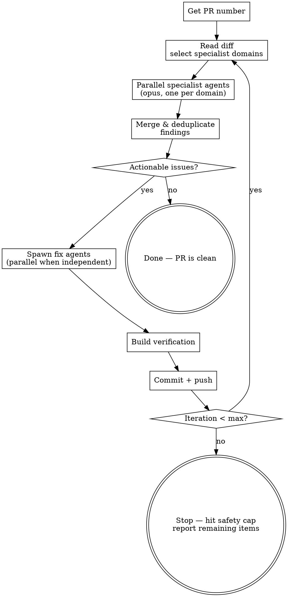

Automated review-fix-push loop for pull requests. Reads the PR diff, spawns a team of specialist review agents in parallel (security, performance, validation, etc. — chosen dynamically based on the diff), merges their findings, fixes what's actionable, pushes, and repeats until the reviews come back clean — or hits the safety cap.

## Workflow



### 1. Get PR Number

Use `$ARGUMENTS` if provided (e.g., `/review-cycle 203`). Otherwise auto-detect:

```bash
gh pr view --json number --jq '.number'
```

Fail clearly if no PR is found.

### 2. Diff Analysis & Agent Selection

Read the PR metadata and diff:

```bash
gh pr view <number>
gh pr diff <number>
```

Analyze what's changing — which files, what domains are touched (API routes, database queries, UI components, auth logic, config changes, etc.) — and decide which specialist agents to spawn.

**Selecting specialist domains:**
- Pick domains where deep focused attention adds value for this specific diff (e.g., "security", "performance", "input validation", "error handling", "accessibility", "correctness", "data integrity")
- Each specialist should cover something the others won't — avoid overlapping mandates
- Scale the number of agents to the PR's complexity — typically 2-4 specialists for most PRs, rarely more than 5. A one-file typo fix needs fewer specialists than a PR touching auth middleware across 20 files
- There is no fixed menu — use your judgment based on what the diff actually contains

**Write a focused prompt for each specialist** that includes:
- The specific domain/lens to review through
- Concrete examples of what to look for in that domain
- The PR number so the agent can fetch the diff itself
- Instructions to categorize findings as "actionable" (fix before merge) vs "informational" (awareness only)
- For round 2+, a summary of what was fixed in prior rounds so the agent doesn't re-flag resolved items

### 3. Parallel Specialist Reviews

Spawn all specialist agents in parallel. Each specialist fetches the diff independently rather than receiving it in its prompt — this avoids prompt size limits on large PRs. Each agent is an **opus** agent that:

1. Fetches the PR diff via `gh pr diff <number>`
2. Reviews the entire diff exclusively through its assigned lens
3. Returns findings in this format:

```
## [Domain] Review

### Actionable
- **[file:line]** — Description of the issue and why it matters

### Informational
- **[file:line]** — Observation (no fix needed)
```

**Include these constraints in each specialist's prompt:**
- Stay in your lane — a security agent should not flag naming conventions, a performance agent should not suggest style changes
- Be specific — cite file paths, line numbers, and what's wrong
- Actionable means "fix before merge"; informational means "be aware"
- Don't suggest refactors or style changes unless genuinely in-domain (e.g., a performance agent flagging an O(n²) loop is in-domain; suggesting a variable rename is not)

### 4. Merge, Deduplicate & Triage

After all specialist agents return:

1. **Merge** all findings into a single list
2. **Deduplicate** — if two agents flag the same location for related reasons (e.g., security agent flags unsanitized input, validation agent flags missing input check on the same line), combine into one finding that preserves rationales from both agents, keeping the most severe categorization
3. **Triage** the merged list:

- **Fix** — genuine issues worth addressing
- **Skip** — style preferences, informational notes, or things that aren't worth the churn

If nothing is actionable, **stop**. The PR is clean.

### 5. Implement Fixes

Group fixes by independence:

- **Independent changes** (different files, no shared state): spawn parallel agents
- **Dependent changes** (shared types, cascading edits): single agent or sequential agents

Each implementation agent prompt must include:
- Exact file paths and line numbers
- What to change and why
- The build command to use for verification (see step 6 for detection)
- Instruction to actually execute (not just plan)

**Shell quoting**: Paths with parentheses (e.g., `(auth)`, `(dashboard)`) must be double-quoted in git and bash commands:

```bash
# Wrong — glob expansion breaks this
git diff apps/web/src/app/(auth)/callback/route.ts

# Right
git diff -- "apps/web/src/app/(auth)/callback/route.ts"
```

### 6. Build Verification

After all fix agents complete, verify the build passes. Detect the project's build system and run the appropriate command:

| Indicator | Build command |
|-----------|--------------|
| `Makefile` | `make build` (or `make` if no build target) |
| `Cargo.toml` | `cargo build` |
| `go.mod` | `go build ./...` |
| `build.gradle` / `build.gradle.kts` | `./gradlew build` |
| `pom.xml` | `mvn compile` |
| `package.json` with `build` script | Use the repo's package manager (`npm run build`, `pnpm build`, `yarn build`, `bun run build`) |
| `turbo.json` | Prefer `turbo build` scoped to affected packages |
| `CMakeLists.txt` | `cmake --build build` |
| None of the above | Check CLAUDE.md or project docs for build instructions; if nothing found, skip build verification and warn the user |

If multiple build systems are present, prefer the one closest to the changed files. When in doubt, check the repo's CLAUDE.md or contributing docs for the canonical build command.

If the build fails, fix the errors before proceeding. Do not push broken code.

### 7. Commit and Push

Stage only the files that were changed. Write a concise commit message summarizing the fixes. Push to the PR branch.

### 8. Loop or Stop

- If iteration count < **5** (safety cap), go back to step 2 with a fresh analysis. Fixes in one area can introduce issues in another, so the specialist mix may change between rounds.
- If at the cap, stop and report any remaining items to the user.

The loop should converge quickly — most PRs are clean after 2-3 rounds.

## Key Design Decisions

| Decision | Rationale |
|----------|-----------|
| Dynamic specialist selection | No fixed menu — the LLM picks review domains based on what the diff actually contains. A config PR gets different specialists than an auth middleware PR. |
| Opus for specialist agents | Reviews require judgment about what matters — Opus catches subtler issues like missing disabled props, misleading pricing text, timing side-channels |
| Parallel specialist execution | All specialists run concurrently — each gets the full diff but reviews through a single focused lens. Faster than sequential. |
| Merged findings, single triage | All specialist output is combined and deduplicated before triaging once. Avoids duplicate fixes when two agents flag the same code. |
| Full re-selection each round | Every iteration re-analyzes the full current diff and re-picks specialists. Fixes in one domain may introduce issues in another. |
| Fresh holistic view each round | Each round re-reads the complete PR diff (including all prior changes), preventing anchoring on prior findings |
| Parallel fix agents | Independent changes don't need to wait for each other |
| Build gate before push | Never push code that doesn't compile |
| Max 5 iterations | Prevents infinite loops if review keeps finding new things from its own fixes |
| Triage step | Not every review finding is worth fixing — human judgment applies |

## Common Mistakes

| Mistake | Fix |
|---------|-----|
| Unquoted paths with parens in shell | Always double-quote paths containing `(` or `)` in git/bash commands |
| Pushing without build verification | Always run the build after fixes, before pushing |
| Re-reviewing without pushing first | The specialist agents read `gh pr diff` — changes must be pushed to be visible to the next round's agents |
| Passing prior review context to new agent | Fresh agent = fresh context. Only pass "what was fixed" summary, not the old findings |
| Fixing informational/style items | Only fix actionable issues — style preferences create unnecessary churn |
| Overlapping specialist mandates | Each specialist should have a distinct domain — if two agents both flag style issues, the mandates overlap. One agent per concern. |
| Too many specialists for a simple PR | Scale agent count to PR complexity. A one-file typo fix doesn't need 5 specialists. |
| Specialists drifting out of lane | A security agent shouldn't flag naming conventions. Prompt each specialist to stay in its domain. |
