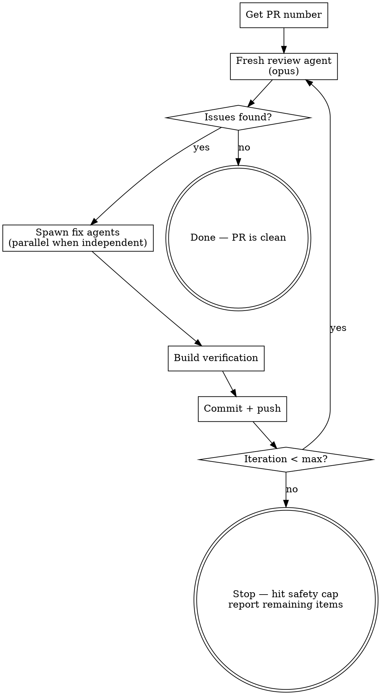

Automated review-fix-push loop for pull requests. Spawns a fresh review agent, fixes what it finds, pushes, and repeats until the review comes back clean — or hits the safety cap.

## Workflow



### 1. Get PR Number

Use `$ARGUMENTS` if provided (e.g., `/review-cycle 203`). Otherwise auto-detect:

```bash
gh pr view --json number --jq '.number'
```

Fail clearly if no PR is found.

### 2. Review (Fresh Agent)

Spawn an **opus** review agent with no carryover from prior rounds. The agent must:

```bash
gh pr view <number>
gh pr diff <number>
```

Then analyze for: correctness, conventions, performance, security, accessibility, and consistency.

**Prompt the agent to categorize findings as either "actionable" (should fix before merge) or "informational" (noting for awareness).** The loop only continues for actionable items.

If this is round 2+, tell the agent what was fixed in prior rounds so it doesn't re-flag resolved items.

### 3. Triage Review Results

Read the agent's findings. Separate into:

- **Fix** — genuine issues worth addressing
- **Skip** — style preferences, informational notes, or things that aren't worth the churn

If nothing is actionable, **stop**. The PR is clean.

### 4. Implement Fixes

Group fixes by independence:

- **Independent changes** (different files, no shared state): spawn parallel agents
- **Dependent changes** (shared types, cascading edits): single agent or sequential agents

Each implementation agent prompt must include:
- Exact file paths and line numbers
- What to change and why
- The project's build command for verification
- Instruction to actually execute (not just plan)

**Shell quoting**: Paths with parentheses (e.g., `(auth)`, `(dashboard)`) must be double-quoted in git and bash commands:

```bash
# Wrong — glob expansion breaks this
git diff apps/web/src/app/(auth)/callback/route.ts

# Right
git diff -- "apps/web/src/app/(auth)/callback/route.ts"
```

### 5. Build Verification

After all fix agents complete, verify the build passes:

```bash
pnpm turbo build --filter=<package>
```

If the build fails, fix the errors before proceeding. Do not push broken code.

### 6. Commit and Push

Stage only the files that were changed. Write a concise commit message summarizing the fixes. Push to the PR branch.

### 7. Loop or Stop

- If iteration count < **5** (safety cap), go back to step 2 with a fresh review agent.
- If at the cap, stop and report any remaining items to the user.

The loop should converge quickly — most PRs are clean after 2-3 rounds.

## Key Design Decisions

| Decision | Rationale |
|----------|-----------|
| Opus for review agents | Reviews require judgment about what matters — Opus catches subtler issues like missing disabled props, misleading pricing text |
| Fresh context each round | Prevents anchoring on prior findings — reviews the actual current diff |
| Parallel fix agents | Independent changes don't need to wait for each other |
| Build gate before push | Never push code that doesn't compile |
| Max 5 iterations | Prevents infinite loops if review keeps finding new things from its own fixes |
| Triage step | Not every review finding is worth fixing — human judgment applies |

## Common Mistakes

| Mistake | Fix |
|---------|-----|
| Unquoted paths with parens in shell | Always double-quote paths containing `(` or `)` in git/bash commands |
| Pushing without build verification | Always run the build after fixes, before pushing |
| Re-reviewing without pushing first | The review agent reads `gh pr diff` — changes must be pushed to be visible |
| Passing prior review context to new agent | Fresh agent = fresh context. Only pass "what was fixed" summary, not the old findings |
| Fixing informational/style items | Only fix actionable issues — style preferences create unnecessary churn |
